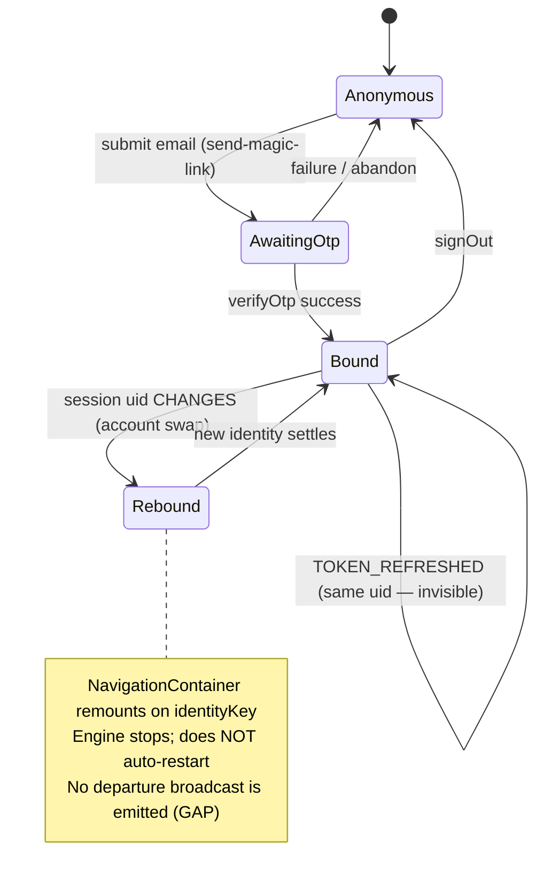
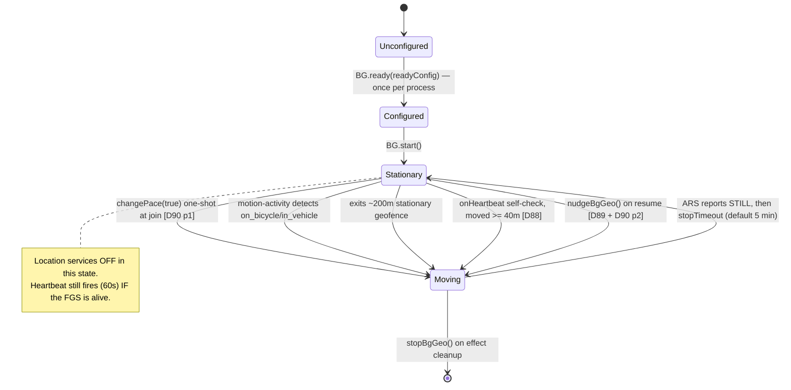
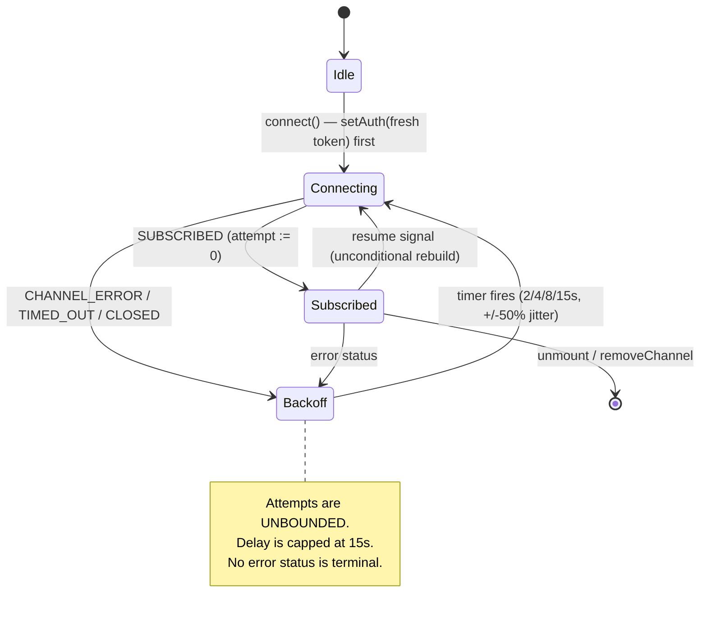
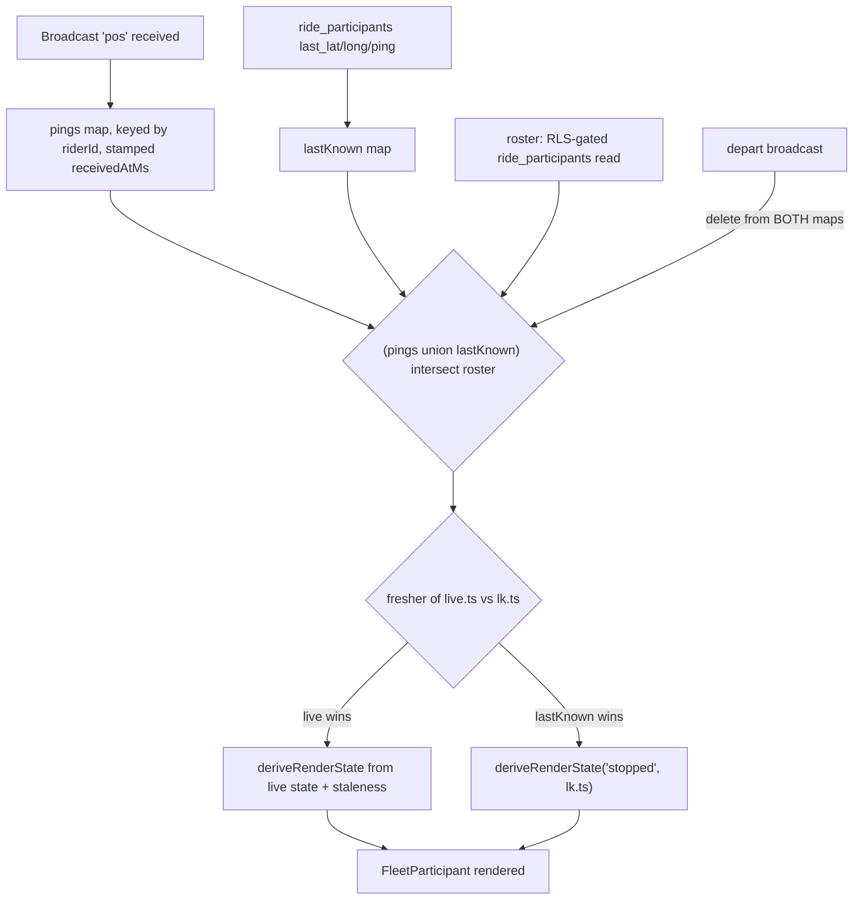
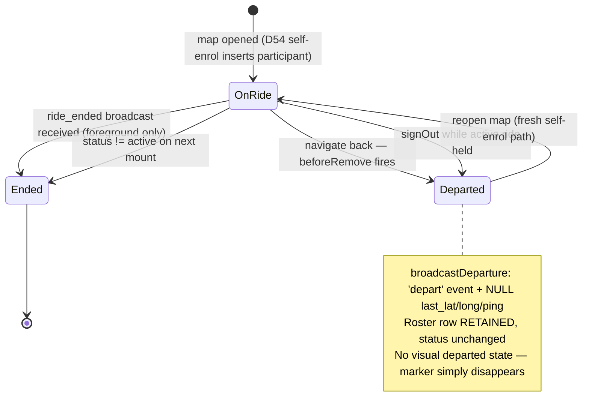

# W277 — Artifact 1: Rail 3 Current State Overview

Project: Vechelon Rail 3 — Mobile Tactical | Parent: G33 (id 5381) | W277 (id 5380)
Survey date: 2026-07-30 | Status: SURVEY OUTPUT — NOT A PILLAR COMMIT
Survey baseline: branch `rail3-integration` @ `2e422f8` (contains D91 `df2a342`; `w204-production-profile` is an ancestor — this is the tree the field build came from)
Drift baseline: Pillar II v1.0.2, Pillar III v1.0.0 (both 2026-05-12), `productdocuments/rail3/`

> **Authority.** This is an assessment. Zero code was changed. Every claim below carries a `file:line` or quoted SQL. Where the build and the committed Specs disagree, that is recorded as drift — not fixed.

---

## 0. Executive summary

Five things a reader should take away before the detail.

1. **The consolidation W277 was chartered to propose has already been built.** The brief's flagship example — unifying the re-engagement detectors into one resume-driven re-assert — exists today at `useFleetPositions.ts:330-348`. D86's Saver-off listener was deleted, D89 and D90 prong 2 are one idempotent call, and D90 prong 1 is merged (not "coded on branch" as the BDD inventory states). The surviving dead code is elsewhere and smaller than expected (§8, SC-6).

2. **The engine is in good shape; the lifecycle *around* it is not.** D91 fixed the teardown. What remains unbuilt is everything that happens when the engine is lost while the app cannot act: no background self-recovery, no server-side staleness detection, no way to reach a locked device. That is BDD Layer 3, and it is entirely absent.

3. **The largest gaps are not in the mobile state engine at all — they are in lifecycle and authorization on the shared Supabase schema.** There is no auto-close scheduler, no purge scheduler, and the purge that exists touches no Rail 3 table. Two authorization defects were filed out of this survey (D93, D94).

4. **Several committed expectations are contradicted by other committed text**, not just by the build. Pillar II §1 excludes guests from the PoC while §4.1 grants "Guest Rider" a full capability column; Pillar II §3 Feature 3 states "No in-app notification to other participants on ride end" while BDD R3-69 requires ride end to reach every device. These are Bedrock-internal conflicts the Brain session must resolve — the Hands cannot.

5. **Two pre-registered drift findings do not survive contact with the code as stated.** Finding (f) describes Leave Ride as an implemented first-class action; there is no such action. Finding (e)'s structural claim about guests is also inaccurate, though the Senior PM's operational assumption holds (§7, finding (e)).

---

## 1. Domain: Identity

### 1.1 State model



### 1.2 Mechanism

| Concern | Implementation | Location |
|---|---|---|
| Identity source | Live session, read per render | `RideMapScreen.tsx:75-76` |
| Change detection | `isIdentityChange(prev, next)` on user id, never event name | `identityDelta.ts:26-28` |
| Classification | `userChanged` computed in `onAuthStateChange` | `AuthContext.tsx:107-109` |
| Cache reset | `resetMeasureIdentity(userChanged)` before `setSession` | `AuthContext.tsx:112-114`, `measure.ts:143-149` |
| Remount boundary | `<NavigationContainer key={identityKey(uid)}>` | `App.tsx:43` |
| Hot-path backstop | `isCurrentIdentity()` — broadcast refuses on mismatch | `identity.ts:45-53`, `backgroundLocation.ts:47-49` |
| Realtime token | `supabase.realtime.setAuth(access_token)` | `AuthContext.tsx:125-127` |

D77's split identity is genuinely closed: both the broadcast and `persistLastKnown` resolve to the live session, so they agree by construction (`useFleetPositions.ts:137-140`).

### 1.3 Findings

- **Engine restart on swap is a stop, not a restart.** The remount unmounts `RideMapScreen`, firing the engine effect cleanup (`useFleetPositions.ts:555-557`). B lands on Home; the engine restarts only when B opens a ride map and `backgroundReady` flips. This satisfies R3-57's "re-bound to rider B, not resumed from rider A" but by teardown, not by re-binding.
- **NEW GAP (not pre-registered): an account swap emits no departure.** `onAuthStateChange` (`AuthContext.tsx:102-128`) contains no departure call, and the React remount deliberately bypasses `beforeRemove` (`RideMapScreen.tsx:285-287`). Rider A therefore lingers on every peer's map as a greying phantom until the Dark threshold. Only the explicit `signOut()` path broadcasts a departure. Bears on **R3-57**.
- **Token refresh is invisible and correct** — same `identityKey`, no remount, no engine touch (`App.tsx:37-39`). Satisfies **R3-59**.

---

## 2. Domain: Tracking-engine lifecycle

### 2.1 State model



### 2.2 Configuration as built (`bgGeo.ts:198-242`)

| Key | Value | Note |
|---|---|---|
| `distanceFilter` | 40 m | W261; cadence is distance-based, not time-based |
| `locationUpdateInterval` | 5000 ms | rate cap, not the cadence driver |
| `disableElasticity` | true | pure fixed-distance filter |
| `heartbeatInterval` | 60 s | Android floor; drives the D88 self-check |
| `foregroundService` | true | persistent notification, streams through Doze |
| `stopOnTerminate` | false | — |
| `stopTimeout` | **not set → vendor default 5 min** | `Config.d.ts:81` |
| `disableStopDetection` | **not set → stop detection ACTIVE** | the W261 un-force posture |

### 2.3 Vendor semantics (brief input #1)

Per the Philosophy of Operation: after `start()` the plugin sits **stationary with location services off**, leaving that state on motion-activity detection or on exiting a **~200 m stationary geofence**. While moving, an ARS `STILL` reading starts a `stopTimeout` timer; on expiry the plugin returns to stationary and turns location services off. The vendor explicitly recommends `changePace(true)` for "start an activity" apps.

The build matches this reading: the one-shot `changePace(true)` at join (`bgGeo.ts:261-265`) is exactly the vendor's recommended pattern, and the deliberate omission of `disableStopDetection` (`bgGeo.ts:257-259`) preserves stop detection.

### 2.4 R3-50 posture — documented, not selected

R3-50 deliberately declines to choose between the two conflicting field postures. **The build implements the `stopTimeout`-stationary posture**, not force-track: stop detection is active, `stopTimeout` sits at the 5-minute default, and a parked rider's location services go off. The W261 rationale is recorded at `bgGeo.ts:76-86`.

Consequence worth surfacing for the Brain session: **the engine's 5-minute stop and the fleet view's 5-minute Inactive threshold coincide by accident, not by design.** They are independently configured — `stopTimeout` is a vendor default the build never sets, and Inactive is a per-tenant column defaulting to 5 min (`20260610000000_rail3_schema.sql:43-46`). A tenant that retunes its thresholds silently desynchronises them.

### 2.5 Findings

- **D91 is correctly implemented.** Engine deps are `[backgroundReady, rideId, myRiderId]` (`useFleetPositions.ts:560`); thresholds moved to a ref (`:216-223`) with the incident recorded inline. The tracker is rebuilt on threshold change without touching the engine (`:565-567`). Satisfies **R3-38**.
- **R3-37 is satisfied on the send path** by the one-shot `changePace(true)`, subject to the Battery-Saver startup delay (R3-43), which remains unticketed and unmeasured.
- **R3-40 (rider self-health warning) is NOT IMPLEMENTED.** No mechanism warns a rider that their own device has stopped producing fixes. The `heartbeat_check` telemetry (`useFleetPositions.ts:542-550`) records the condition but surfaces nothing to the rider. This is the "OS blue dot masks a dead engine" case and it remains fully silent on the rider's own device.
- **R3-41 (stale surfaced to Captain/SAG) is NOT IMPLEMENTED.** There is no stale state distinct from Dark. The committed status labels (`Pillar II §5.3`) define exactly five presentations and none is a stale/self-health state.
- **R3-45 (engine telemetry) is partially satisfied.** `motion_change`, `heartbeat_check`, `bg_nudge`, `gps_ping` are all logged to the measurement sink. Power state is **not** captured at engine init or on change, so the scenario's requirement to distinguish OEM-suspension from engine-torn-down is only partly met.

---

## 3. Domain: Power / OEM throttle

### 3.1 Mechanism inventory (`batteryGuards.ts`)

| Export | Line | Callers | Status |
|---|---|---|---|
| `isBatterySaverOn` | `:35` | 0 external | exported-unused |
| `promptIfBatterySaverOn` | `:58` | `RideMapScreen.tsx:212` (`'join'` only) | advisory, live |
| `watchBatterySaverOnScreenLock` | `:77` | **0 — DEAD CODE** | see below |
| `getOemBatteryInstructions` | `:102` | 0 external | exported-unused |
| `promptOemExclusionOnFirstJoin` | `:141` | `RideMapScreen.tsx:211` | advisory, live |
| `acquireRideWakelock` | `:181` | `RideMapScreen.tsx:213` | live |
| `releaseRideWakelock` | `:189` | `RideMapScreen.tsx:239` | live |

### 3.2 Findings

- **Every power mechanism is advisory-only.** Each terminates in an `Alert.alert` with a settings shortcut and returns a boolean nobody consumes (both calls are `void`ed at `RideMapScreen.tsx:211-212`). Nothing in `batteryGuards.ts` is load-bearing for tracking. This satisfies **R3-49** cleanly — no advisory has become structurally load-bearing.
- **The dead detector is `watchBatterySaverOnScreenLock`, and its absence is itself a spec violation.** The function exists with zero callers. Its removal from the wiring was deliberate (`log_of_changes.md:311`) but the body was left behind. Critically, **Pillar II §2 commits to it**: *"On ride join **and on screen lock**, the app checks for Battery Saver mode"* (`Pillar II:146`), and **R3-06 is a committed scenario** ("Battery Saver mode detected on screen lock", `Pillar III:178`). So this is not merely dead code — the build has silently dropped a committed behaviour. The `'screen-lock'` arm of `promptIfBatterySaverOn`'s context union is now unreachable, and the module header (`batteryGuards.ts:24`) still claims the removed behaviour.
- **R3-46/47 are satisfied by cause-agnostic design.** The build no longer detects Saver transitions at all; the resume-nudge re-asserts the engine on every unlock regardless of cause. This is strictly more robust than the edge listener it replaced, and it explicitly does not depend on a background-unreliable OS listener (R3-47's requirement).
- **R3-48 fails at the first link.** The recovery chain is specified as background self-recovery → foreground re-assert → self-health warning → command-surface stale. Only the second link exists. The invariant "at no point does the failure remain fully silent on all surfaces" **does not hold**: a suspended engine on a backgrounded device is silent on the rider's device, silent on the Captain's map until the 15-minute Dark threshold, and silent to the server entirely.
- **R3-43 (Saver-at-start delay) is unimplemented as a bounded, observed behaviour.** The ~3–4 min delay is field-observed but not measured, not gated, and nothing prevents a future self-health threshold from firing inside that window.

---

## 4. Domain: Channel / resume

### 4.1 State model



### 4.2 Resume signal (`resumeDetector.ts`, `useResume.ts`)

| Constant | Value | Meaning |
|---|---|---|
| `CLOCK_TICK_MS` | 1000 | driver tick |
| `CLOCK_GAP_THRESHOLD_MS` | 4000 | JS thread was suspended |
| `RESUME_DEBOUNCE_MS` | 1200 | trailing coalesce window |
| `CHANNEL_SILENCE_MS` | 90000 | staleness sweep trigger |
| `STALE_COOLDOWN_MS` | 300000 | re-sweep cooldown |

Three emitters (clock-gap, AppState, staleness sweep) coalesce into one signal with **four** subscribers — `useRideChannel.ts:59`, `useFleetPositions.ts:348`, `useBreadcrumb.ts:137`, `useBeacons.ts:128`. Source attribution is first-writer-wins; there is no priority ordering (`resumeDetector.ts:81-84`).

### 4.3 Findings

- **R3-51 satisfied.** Token refresh is pushed onto the socket at `AuthContext.tsx:125-127`, and every (re)subscribe calls `getSession()` then `setAuth()` first (`useRideChannel.ts:105-109`), so a resubscribe can never use a stale token. Note the handler is deliberately event-agnostic — `TOKEN_REFRESHED` appears nowhere in code, only in comments. `jwt_expiry = 3600` (`config.toml:158`) means ~9 refreshes on a 9-hour ride.
- **R3-52 satisfied in full**, including the jitter clause: capped exponential backoff `min(15000, 1000 * 2^min(attempt,4))` with ±50% jitter, unbounded attempts, no terminal error state (`useRideChannel.ts:149-161`).
- **R3-53 partially satisfied.** The mechanism is device-agnostic as required (clock-gap + AppState + staleness sweep, coalesced). But the "~1 second" figure is not met by construction: `flushDue` only runs inside the 1 s tick after a 1.2 s debounce, so **emission latency is 1.2–2.2 s before the reconnect even begins**. The BDD flags the number as `[UNTRACED]`; the survey's answer is that ~1 s is not achievable without changing the debounce.
- **R3-54 satisfied.** Receive recovery and send recovery are genuinely independent: the same `onResume` callback rebuilds the channel and calls `nudgeBgGeo()` as separate actions, and the send effect is explicitly *not* gated on channel status (`useFleetPositions.ts:444-448`) — a lesson learned from the 2026-06-15 field test.
- **R3-55 NOT IMPLEMENTED.** Recovery is events-forward only. Positions catch up via the last-known seed, but **a Support Beacon raised while a rider was receive-blind is permanently lost** — Broadcast is fire-and-forget and there is no snapshot-on-recovery. `useBeacons` subscribes to the resume signal but (per the survey scope) reconciles only its own fetch, not the missed-event gap. This is the single most consequential unbuilt item in this domain: it is a safety signal.
- **Residue:** `lastStatus` is assigned but never read for control flow (`useRideChannel.ts:73,126`).

---

## 5. Domain: Fleet render lifecycle

### 5.1 Render derivation



Composition is `(pings ∪ lastKnown) ∩ roster` (`useFleetPositions.ts:653-696`). Unknown riderIds are dropped — for a Rider, "unknown" is exactly the set RLS hid, so the §4.1 boundary holds even before client filtering. A **live** ping from an unknown rider triggers a debounced roster refetch; a stored last-known from an unknown rider does not (`:656-663`).

### 5.2 Committed fleet-view state machine (Pillar II §3 Feature 4)

| State | Trigger | Default |
|---|---|---|
| Active | moving ping received | — |
| Stopped | no movement 2 min | `rail3_stopped_threshold_minutes` |
| Inactive | no movement 5 min | `rail3_inactive_threshold_minutes` |
| Dark | no ping 15 min | `rail3_dark_threshold_minutes` |

Defaults match the schema (`20260610000000_rail3_schema.sql:43-46`) and `DEFAULT_THRESHOLDS`.

### 5.3 Findings

- **R3-62 satisfied.** Seed-then-upgrade works as specified; the precedence rule (fresher of the two timestamps, both from the same sender's clock) is correct and documented at `useFleetPositions.ts:643-652`. `myCoords` additionally seeds from the OS last-known fix for perceived start (`:242-253`).
- **A sixth render state exists that the Pillar does not commit.** `RiderMarker.tsx:40-43` renders `dormant` (violet) for riders on the no-background-tracking path. Pillar II §5.3 commits exactly five presentations and `dormant` is not among them. **Drift.**
- **The periodic last-known write is not a "meaningful event".** Pillar II §2 permits DB writes "at meaningful events only: beacon alert trigger, beacon cancel, ride start, ride end, final rider state" (`Pillar II:121`). W266 writes `last_lat/last_long/last_ping` **every 60 seconds while moving** (`useFleetPositions.ts:483-487`). The code asserts this sits "within the Pillar II §2 last-known exception" (`:123-128`) — **no such exception exists in the committed text.** This is undocumented drift, and it is the one place the "no coordinate storage" posture is closest to its edge. It remains a single overwritten row per rider, not a trail, so the privacy pillar is not breached — but the permission was assumed, not granted.
- **R3-63 satisfied for the join case**; the RSVP clause needs re-basing (see §9, integration surface).
- **R3-66 holds at the UI layer but not the server layer.** The roster page reuses `roleVisibility.ts` verbatim and is no looser than the map (`RosterScreen.tsx:27-31`, `:110-113`, `:126-133`). But `participant_tactical_select` over-returns phone to affiliated-tenant riders (D50, still owed), and D94 shows the broadcast channel is tenant-scoped. The envelope is enforced by client discipline, not by the server.

---

## 6. Domain: Departures & ride end

### 6.1 State model



### 6.2 Findings

- **There is no Leave Ride action.** Departure is an implicit side effect of navigating off the map (`RideMapScreen.tsx:288-294`). It is not confirmed, not two-tap, not labelled. Note this is *spec-compliant*: Pillar II §5.1 commits "Confirmation gates — two actions only. End Ride (two-tap). Ad Hoc Ride creation…" — so adding a confirm to departure would itself require an amendment.
- **Teardown is otherwise complete** — engine stopped (`useFleetPositions.ts:555-557`), channel removed, wakelock released, departure broadcast, `last_*` nulled so no seed resurrects the departed rider. **R3-67 substantially satisfied**, **R3-65 satisfied** on the "departure beats seed" clause.
- **Departure is not visually distinguishable — it is an absence.** A departed rider simply vanishes (`useFleetPositions.ts:403-417`), whereas signal-loss greys through Stopped → Inactive → Dark. R3-65's "distinguishable from Dark, stale and greyed" is technically met (gone ≠ grey), but "distinguish *left the ride* from *lost from the ride* at a glance" is met only by inference from absence — and a rider whose device was locked when the `depart` event fired never receives it at all. The `last_*` null-out covers them on the next last-known refetch, which is the saving grace.
- **R3-71 satisfied.** No departure path writes `rides.status`; the only writer is the captain's End Ride (`rideControlsLogic.ts:26-34`). The ride survives any departure including the Captain's.
- **SC-2 / command coverage after Captain departure: no transfer exists.** End Ride is gated `myRole === 'captain'` client-side (`RideMapScreen.tsx:559-561`) and `ride_admin_modify` (tenant admin OR `created_by`) server-side. The breadcrumb leader is immutably `rides.started_by`. A departed Captain leaves the ride with no in-app command authority — recoverable only by that Captain returning, or by a tenant admin acting server-side.
- **R3-69 fails for backgrounded devices — and contradicts committed text.** `ride_ended` is an ephemeral websocket broadcast (`RideControls.tsx:73`); `useRideDetails` reads status on mount only and is not a resume consumer. A pocketed rider never learns the ride ended and keeps tracking. **But Pillar II §3 Feature 3 explicitly commits "No in-app notification to other participants on ride end"** (`Pillar II:252`). The build's alert-and-navigate-back already exceeds the committed spec. R3-69's requirement is therefore a *proposed change to committed Bedrock*, not a defect against it — the Brain must reconcile the two.
- **R3-70 cannot be satisfied because the purge does not run** (§8, retention).

---

## 7. Pre-registered drift findings (a)–(g)

| # | Verdict | Evidence |
|---|---|---|
| (a) | **CONFIRMED** | Pillar II §2 Stack commits expo-location (`Pillar II:65`, `:126`); the build runs Transistorsoft as sole engine since W203 (`bgGeo.ts:7`). R3-34/35 name the expo task explicitly. Build-vs-buy decision undocumented in any Pillar. |
| (b) | **CONFIRMED** | Pillar II's only state table is Feature 4 (`Pillar II:275-281`) — the fleet-view machine. No engine moving/stationary/dormant model exists in committed text. §2 above is the first written form. |
| (c) | **CONFIRMED** | No resume model in the 2026-05-12 Bedrock. The entire W269 resume architecture (three emitters, coalescer, four subscribers) is uncommitted. |
| (d) | **CONFIRMED** | D91's root cause (thresholds in the engine dep array causing self-teardown) and its fix appear in no Pillar. Recorded only in code comments (`useFleetPositions.ts:216-223`, `:558-559`) and the Stride record. |
| (e) | **CONFIRMED with a correction** | Roster page is implemented (`RosterScreen.tsx`), absent from Pillar II's feature index (`Pillar II:175-186`), no spec, no BDD. Gating matches §4.1 at the UI layer. **Correction below.** |
| (f) | **REFUTED as stated** | There is no Leave Ride action — grep confirms no such control anywhere in `mobile/src`. Departure is implicit on navigating back. The *behaviour* (departure, ride survival, teardown) is implemented and working; the *first-class action* described in the finding is not. |
| (g) | **CONFIRMED** | Breadcrumb implemented (`useBreadcrumb.ts`, `rail3_breadcrumb` table, leader-gated upsert). Absent from Pillar II's feature index *and* from its New Rail 3 Tables list (`Pillar II:97-101`), which names only `beacon_alerts` and `rider_states`. No spec, no BDD, no recorded decision. |

### Finding (e) — the guest correction

The finding's current-state statement is that "the PoC correctly excludes guest participation; guests exist only portal-side."

**Operationally this holds, and the Senior PM has confirmed it** (ruling 2026-07-30): there is no guest join path in the app, no guest is exposed to the PoC, and any `account_id IS NULL` rows observed on a test ride were captain-seeded test data.

**Structurally the claim does not hold**, and the difference matters for the forward-intent half of the finding:

- There is no separate guest table. Guests are rows in `ride_participants` with `account_id NULL`, `role='guest'`, `status='rsvpd'` (`supabase/functions/guest-rsvp/index.ts:112-121`; the function's own contract note at `:19` reads *"account_id is always NULL — identity is tied via session_cookie_id"*).
- The **map** filters them out incidentally, by one line: `if (!row.account_id) continue;` (`useFleetPositions.ts:95`).
- The **roster page renders them deliberately.** `RosterScreen.tsx:21-25`: *"A scrollable list of EVERYONE on the ride — including non-app guests (account_id NULL) that the captain seeded."* W250 built this on purpose.

So guests are not *structurally* invisible to every Rail 3 surface — one surface is already built to show them. Read forward rather than as a fault, this is **good news**: part of the guest-support work the Rail 3a Brain session will ratify already exists.

It also surfaces a **Bedrock-internal conflict** the Brain must resolve. Pillar II §1 states *"Participants: Registered members only. No guest join flow in PoC"* (`Pillar II:25`) and R3-33 reinforces it. But Pillar II §4.1's capability matrix is columned **"Rider / Guest Rider"** (`Pillar II:326`), and §4.2 commits *"Guest Riders and Member Riders have identical Rail 3 capability — role governs access, not account type"* (`Pillar II:360`). Committed text simultaneously excludes guests from the PoC and grants them a full capability envelope. Guest join remains gated behind PDoD-03; the capability envelope does not.

---

## 8. SURVEY CHECK answers (SC-1 – SC-8)

**SC-1 — Sign-out during an active ride without leaving first.**
`AuthContext.signOut` (`:143-162`) reads the active-ride holder; if set, it broadcasts a departure and nulls `last_*` via `broadcastDeparture`, clears the holder, then calls `supabase.auth.signOut()`. Ordering is correct — the departure runs while the JWT is still valid. It does **not** call `stopBgGeo`. In practice reaching the Sign Out button requires popping the ride map first (the control lives only on Home, `HomeScreen.tsx:161`), which already fired `beforeRemove` → departure and the effect-cleanup → `stopBgGeo()`. The net effect is a **redundant second departure broadcast**, explicitly sanctioned (`activeRide.ts:9-10`). Satisfies **R3-58**: sign-out ends the session and triggers no further ride action beyond the idempotent departure.

**SC-2 — Command coverage after Captain departure.**
No authority transfer exists. See §6.2.

**SC-3 — Breadcrumb when upserts cease.**
It **persists indefinitely, never ages, and is never marked.** The adopt rule is length-only, never timestamp-based (`useBreadcrumb.ts:107-110`); `updated_at` is written but never read client-side; the polyline renders at fixed colour and width (`RideMapScreen.tsx:455-463`). The trail clears only on ride change. **R3-72 fails** — a frozen trace is presented exactly as a live one.

**SC-4 — Roster derivation and guest visibility.**
Roster derivation reads participant rows, not join events — and RSVP and join are the same row, so the distinction does not exist in the data model (see §9). Guests are **not** invisible to every Rail 3 surface: the roster page renders them by design. See §7 finding (e) for the full treatment and the Senior PM's operational ruling.

**SC-5 — `myRiderId` in engine deps: intentional or incidental?**
**Intentional, and load-bearing.** It is one of the three surviving deps after D91 removed thresholds (`useFleetPositions.ts:560`), and the D91 comment names the dep list deliberately (`:558-559`). Its effect is that an identity change tears the engine down — which R3-57 requires ("the tracking engine's lifecycle is re-bound to rider B"). The nuance: it delivers a *stop*, not a *re-bind*; restart waits for B to open a ride map. Intentional as a guard, incidental as a restart mechanism.

**SC-6 — Which Layer 2 detectors remain wired.**
The BDD inventory's premise needs correcting. Of the four:

| Detector | State |
|---|---|
| D86 Saver-off edge listener | **REMOVED entirely** (`batteryGuards.ts:87-92` tombstone; zero code references) |
| D88 movement heartbeat | **WIRED and live** (`bgGeo.ts:155-186`), instrumented (`useFleetPositions.ts:542-550`) |
| D89 resume-poll | **WIRED, merged into the unified re-assert** (`useFleetPositions.ts:330-348`) |
| D90 prong 2 resume re-assert | **WIRED, same call site as D89** — they are one action, not two |

So the cluster is not "largely dead code": it is one deletion, one surviving distinct mechanism (D88, which actively samples position rather than blindly nudging), and one already-completed consolidation. **D90 prong 1 is merged, not "coded on branch"** as §3 of the BDD states — it is at `bgGeo.ts:261-265`.

The genuine dead code is elsewhere: **`watchBatterySaverOnScreenLock`** (`batteryGuards.ts:77-85`, zero callers) — whose absence also silently drops committed behaviour (Pillar II §2, R3-06) — plus `isBatterySaverOn` and `getOemBatteryInstructions` (exported, unused) and `lastStatus` (`useRideChannel.ts:73,126`, assigned never read).

**SC-7 — Roster page: gating, data source, availability.**
Data source: a direct one-shot read in `RosterScreen.tsx:77-81` — `ride_participants` select `id, account_id, display_name, phone, role, accounts(name, phone)` filtered on `ride_id`. No shared hook. Viewer role from `useRideDetails(rideId).myRole`, failing closed to `'member'` (`:66-67`).
Gating: riders see only command roles (`:110-113`); phone renders only when `iAmCommand || canSeePhone(myRole, item.role)` (`:126-133`). This matches §4.1/R3-32 at the UI layer and is no looser than the map — but it is **UI-layer enforcement only**, and the file says so (`:29-31`): `participant_tactical_select` still over-returns phone to affiliated riders (D50).
Availability: reachable while the ride map is open; no ride-state or membership window beyond that.

**SC-8 — Last-participant behaviour.**
**NOT IMPLEMENTED.** No participant counting and no ride-close-on-empty exists anywhere in `mobile/src`. The only writer of `status='saved'` is the captain's End Ride. An empty active ride simply persists — which is what R3-71 calls "valid, bounded state", except the backstop it relies on (midnight auto-close) does not run either (§9).

---

## 9. Re-engagement mechanism inventory — corrected against code

| Layer | BDD §3 claim | Survey verdict |
|---|---|---|
| **L0** | D91 lifecycle decoupling built; D90 p1 "coded on branch" | **More built than stated.** D91 confirmed. D90 p1 is **merged** at `bgGeo.ts:261-265`. |
| **L1** | TS motion-activity primary; ~200m geofence exit | **Confirmed**, and vendor-grounded. Both are stock plugin behaviour; the build neither disables nor tunes them. `stopTimeout` sits at the 5-minute default. |
| **L2** | D86/D88/D89/D90p2, "largely dead code" | **Materially different.** One removed, one live and distinct (D88), two already consolidated into one call. See SC-6. |
| **L3** | Does not exist | **Confirmed absent.** No native heartbeat/headless task, no `autoSync`, no server-detected staleness, no FCM wake. Nothing in the schema or edge functions performs staleness detection. |

**Current state, restated:** Layer 0 + Layer 1 + the D88 heartbeat (FGS-dependent) + one glance-dependent fallback. Against OEM suspension of a *healthy* engine — the D88 S20 FE class, where the FGS itself is killed and the heartbeat cannot fire — **there is no built mechanism, and no surface reports the failure.** That is unchanged from the BDD's assessment.

---

## 10. Rails 1 & 2 integration surface

No contract document existed before this section. What follows is that contract as implemented.

### 10.1 Auth contract

| Property | Value | Source |
|---|---|---|
| Token lifetime | `jwt_expiry = 3600` (1 hour) | `config.toml:158` |
| Refresh | Supabase refresh token; app is event-agnostic about it | `AuthContext.tsx:102-128` |
| Native sign-in | 6-digit email OTP (D48) via `send-magic-link` | `supabase/functions/send-magic-link/` |
| Session timebox | none — `[auth.sessions]` commented out | `config.toml:265` |
| Identity in RLS | `auth.uid()` | throughout |
| Tenant in RLS | **table lookup**, not a JWT claim: `SELECT tenant_id FROM account_tenants WHERE account_id = auth.uid() LIMIT 1` | `20260418000001:13-17` |
| Custom claims | none — `[auth.hook.custom_access_token]` commented out | `config.toml:277` |

Two consequences worth the Brain's attention. First, **tenant resolution is an unordered `LIMIT 1`** — a multi-tenant account is authorized against whichever row Postgres returns, which is a live correctness issue for the multi-membership work already on the roadmap. Second, **every RLS decision costs a table read** via SECURITY DEFINER helpers (`is_captain_or_support`, `get_tenant_status`, `get_my_tenant_id`), evaluated per row and — for `realtime.messages` — per message.

A 9-hour ride crosses ~9 token refreshes. R3-51's machinery handles this correctly (§4.3).

### 10.2 Ride-list read contract (R3-73)

```js
// HomeScreen.tsx:124-133
supabase.from('rides')
  .select('id, name, status, scheduled_start')
  .eq('status', 'active')
  .order('scheduled_start', { ascending: false })
  .limit(20)
```

- **Only `status='active'` rides are listed.** R3-73 expects rides "upcoming or already started"; upcoming/scheduled rides are **never presented**. Drift.
- **There is no time window at all.** An `active` ride from any date lists forever — and because auto-close does not run (§10.4), stale active rides accumulate permanently.
- Tenant scoping is RLS-only; no client filter. Refetched on every screen focus.
- RSVP affects neither listing nor joinability; every listed card navigates straight to the map.

### 10.3 Guest boundary

Covered in §7 finding (e) and SC-4. The structural summary: guests are `ride_participants` rows, not a separate entity; the map excludes them by a null-check, the roster includes them by design; committed Pillar text is internally inconsistent about whether they belong in Rail 3 at all.

**What would need rework to support guest participants**, per the brief's forward-intent question:

1. **`rider_id` FKs block guests.** `beacon_alerts.rider_id` and `rider_states.rider_id` are both `NOT NULL REFERENCES accounts(id)` (`20260610000000_rail3_schema.sql:51-81`). A guest with no account cannot raise a Support Beacon or hold a rider state. Since the beacon is the Rider's primary action (Pillar II §4.2), guest support is not a UI change — it is a schema change.
2. **Everything is keyed on `account_id`.** The fleet map keys on it, RLS keys on `auth.uid()`, `is_rail3_ride_participant` matches `account_id = auth.uid()`. A guest identified by `session_cookie_id` has no `auth.uid()` and therefore fails every Rail 3 RLS gate closed.
3. **The roster page already works** — it renders `account_id NULL` rows today. No rework needed there.
4. **The map needs one line changed** plus a decision about what identity a guest marker carries.

### 10.4 Shared write surface

| Table | Mobile writes | Portal (`admin/`) writes |
|---|---|---|
| `ride_participants` | insert on self-enrol; update `last_*` | insert (`RideBuilder.tsx:322`) |
| `rides` | update `status`/`actual_end`/`finish_coords` on End Ride | insert, delete |
| `rail3_breadcrumb`, `beacon_alerts`, `rider_states` | full | **none** |

The portal does not touch any Rail 3 table — clean separation in that direction. The genuinely shared surface is `ride_participants` and `rides`, and it is where both authorization defects landed.

### 10.5 Lifecycle machinery that does not run

- **Midnight auto-close: NO SCHEDULER.** The edge function exists (`supabase/functions/auto-close-rides/index.ts:11-22`) and would close *all* active rides globally with no tenant or time-of-day filter. But there is no `pg_cron`, no `cron.schedule`, no `pg_net`, and no schedule entry in `config.toml`. Nothing invokes it.
- **Hard Purge: NO SCHEDULER, and incomplete scope.** `hard-purge-location/index.ts:17-46` nullifies `last_lat`, `last_long`, `phone` and sets `status='purged'` for rides saved >4h ago. Nothing invokes it. Even if invoked it does not clear `last_ping`, `email`, `display_name`, or `session_cookie_id`, and **it touches no Rail 3 table** — `beacon_alerts`, `rider_states` and `rail3_breadcrumb` are never purged. The migrations only *comment* that a 4-hour purge will clear them.
- **Consequence:** `rail3_breadcrumb` retains the complete leader route as JSONB **indefinitely**. This is the sharpest tension with the privacy posture in the whole survey: Vechelon's stated position is that it never persists coordinate trails, and this table is a coordinate trail with no expiry actually running. It is a small number of rows today, but the retention rule that justifies it is unimplemented.
- **R3-36 fails, V-008 would fail** if run today. R3-70 ("data persists until the committed Hard Purge executes") is technically true only because the purge never executes.

---

## 11. Scenario grading summary

Committed scenarios (R3-01–36) were not re-graded except where the delivered set references them. Grades below are for the delivered set R3-37–R3-73.

| Verdict | Scenarios |
|---|---|
| **Satisfied** | R3-37, R3-38, R3-46, R3-47, R3-49, R3-51, R3-52, R3-54, R3-56, R3-57*, R3-58, R3-59, R3-60*, R3-62, R3-63, R3-65, R3-67*, R3-68, R3-71 |
| **Partially satisfied** | R3-39 (fallback only; primary path absent), R3-44 (machines distinct but thresholds desynchronised), R3-45 (no power state), R3-50 (posture documented; long-ride envelope unmeasured), R3-53 (mechanism yes, ~1s no), R3-66 (UI yes, server no) |
| **Not implemented** | R3-40, R3-41, R3-42, R3-55, R3-61, R3-69†, R3-70†, R3-72 |
| **Refuted / re-based** | R3-43 (unmeasured), R3-64 (retired), R3-73 (drift — active-only, no window) |

\* with the caveats recorded in the relevant domain section.
† fails against machinery that does not run, or against committed text that says the opposite.

---

## 12. Open items the Hands cannot resolve

These require Brain-session decisions and are carried into Artifact 2:

1. Guest boundary — Pillar II §1 vs §4.1/§4.2 contradict each other.
2. Ride-end reachability — R3-69 vs Pillar II §3 Feature 3's "No in-app notification".
3. Whether stale/self-health is a fifth state, a Dark refinement, or an overlay (R3-41).
4. Which stop-detection posture is canonical (R3-50) — the survey documents, it does not select.
5. The self-health threshold value, and whether it gates on the Saver-at-start window (R3-40/43).
6. Whether the periodic last-known write is a permitted exception to Pillar II §2's meaningful-events rule.
7. The presentation window for the ride list (R3-73).

---

*End of Artifact 1. Recommendations follow in `w277_artifact2_recommendations.md`.*
