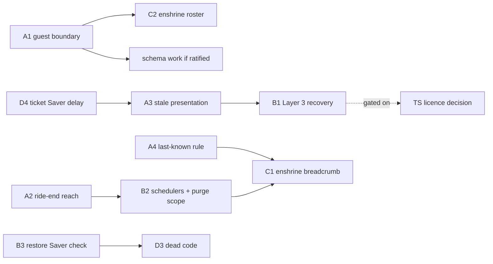

# W277 — Artifact 2: Recommendations for the Strategic Re-engagement Session

Project: Vechelon Rail 3 — Mobile Tactical | Parent: G33 (id 5381) | W277 (id 5380)
Survey date: 2026-07-30 | Companion: `w277_artifact1_current_state.md`
Status: PROPOSALS — not tickets. Nothing here is committed work until the Brain decides.

> Every recommendation states **(a)** the problem it solves, **(b)** the states/detectors it touches, and **(c)** its Bedrock impact — affected Pillar II sections and BDD scenarios. Recommendations without a Bedrock mapping are out of contract.

---

## How to read this set

Recommendations are grouped by **what kind of decision they need**, not by severity — because the Brain session's scarce resource is ratification, not effort.

- **Class A — Bedrock conflicts.** Committed text contradicts itself or contradicts the delivered BDD. The Hands cannot act at all until these are resolved. **Start here.**
- **Class B — Committed-but-unbuilt.** The Bedrock already says it; the build doesn't do it. Needs prioritisation, not ratification.
- **Class C — Built-but-uncommitted.** Working behaviour with no home in the Pillars. Needs enshrinement (MACD) so it stops being invisible.
- **Class D — Tactical.** No Bedrock impact beyond a scenario reference. The Hands can execute on a normal ticket once told to.

One framing note for the session. **The consolidation this survey was chartered to propose already exists** (Artifact 1 §0.1, SC-6). The engine-lifecycle work is done and field-validated. The fragility that remains is not in the engine — it is in the *lifecycle around* the engine: what happens when the device cannot act, and what happens to data after the ride. That is where these recommendations concentrate.

---

# Class A — Bedrock conflicts (resolve first)

## A1. Resolve the guest boundary — Pillar II contradicts itself

**(a) Problem.** Committed text simultaneously excludes and includes guests. Pillar II §1 states *"Participants: Registered members only. No guest join flow in PoC"* (`Pillar II:25`), reinforced by R3-33. But §4.1's capability matrix is columned **"Rider / Guest Rider"** (`Pillar II:326`) and §4.2 commits *"Guest Riders and Member Riders have identical Rail 3 capability — role governs access, not account type"* (`Pillar II:360`). The build sits in the gap: the map excludes guests by a null-check (`useFleetPositions.ts:95`), the roster page includes them by design (`RosterScreen.tsx:21-25`). No one is wrong; the Bedrock is ambiguous.

The Senior PM has ruled (2026-07-30) that the PoC is not exposed to guests and that observed guest rows were captain-seeded test data. That settles the *operational* question and should be recorded. It does not settle which committed statement governs forward.

**(b) States/detectors touched.** Roster derivation; fleet composition (`pings ∪ lastKnown ∩ roster`); the §4.1 role envelope. No engine or recovery state.

**(c) Bedrock impact.** Pillar II §1 (PoC participants), §4.1 (capability matrix), §4.2 (role behaviour notes). BDD R3-60, R3-62, R3-63, R3-66; SC-4. Committed R3-33. Gated behind PDoD-03.

**Decision needed:** does the "Guest Rider" column in §4.1 describe Rail 3a production only, or does it describe the PoC too? An amendment either way removes the ambiguity.

**Note for sequencing:** if guest support is ratified, it is a **schema** change, not a UI change — see D2 below.

---

## A2. Reconcile ride-end reachability — R3-69 contradicts committed Pillar II

**(a) Problem.** BDD R3-69 requires that ride end "reaches backgrounded and locked devices, not only foregrounded ones," and that an unreachable device completes teardown on next contact. **Pillar II §3 Feature 3 commits the opposite**: *"No in-app notification to other participants on ride end"* (`Pillar II:252`). The build already exceeds the committed spec — it broadcasts `ride_ended` and alerts foregrounded riders (`RideControls.tsx:73`, `RideMapScreen.tsx:261-269`) — while still failing R3-69, because the broadcast is ephemeral and `useRideDetails` reads status on mount only.

The live consequence: a pocketed rider keeps tracking and broadcasting on a ride that has ended, until they reopen the app.

**(b) States/detectors touched.** Ride-end teardown; the resume signal (a candidate carrier — `useRideDetails` is the one major hook that is *not* a `useResume` subscriber); engine stop; FGS notification lifecycle.

**(c) Bedrock impact.** Pillar II §3 Feature 3 (End Ride post-confirmation actions) — **requires amendment if R3-69 is ratified**. Pillar II §2 (background task de-registration). BDD R3-69, R3-67; committed R3-26, R3-35.

**Decision needed:** is "no in-app notification on ride end" still the intent? If yes, R3-69 must be re-based. If no, §3 Feature 3 needs a MACD.

**Cheapest compliant fix if ratified:** make `useRideDetails` a resume subscriber. That closes the gap on every unlock without any push infrastructure, and reuses machinery that already exists. It does not reach a device that is never unlocked — that needs A3/B1.

---

## A3. Decide the stale / self-health presentation — the fifth-state question

**(a) Problem.** R3-40 (rider warned on their own device) and R3-41 (same stale state surfaced identically to Captain and SAG) are both unimplemented, and both are blocked on an undesigned presentation. Pillar II §5.3 commits exactly five status presentations (`Pillar II:403-409`) and none is a stale/self-health state. Meanwhile the build already renders a **sixth, uncommitted** state — `dormant` violet (`RiderMarker.tsx:40-43`) — for the no-background-tracking path.

Until this is decided, the D88 failure class (healthy-looking device, dead engine, OS blue dot masking it) remains silent on every surface.

**(b) States/detectors touched.** Fleet-view state machine (Active/Stopped/Inactive/Dark + the uncommitted `dormant`); the self-health detector that does not yet exist; `heartbeat_check` telemetry (`useFleetPositions.ts:542-550`), which already records the condition but surfaces nothing.

**(c) Bedrock impact.** Pillar II §3 Feature 4 (state machine table), §5.3 (status labels) — amendment required either way, since `dormant` is already shipping uncommitted. BDD R3-40, R3-41, R3-44, R3-48; committed R3-08–R3-17 role rendering.

**Decision needed:** fifth state, Dark refinement, or overlay — and separately, whether `dormant` is enshrined or removed. Also the self-health threshold value, which must sit above the Saver-at-start window (A4).

---

## A4. Rule on the periodic last-known write vs "meaningful events only"

**(a) Problem.** Pillar II §2 permits DB writes *"at meaningful events only: beacon alert trigger, beacon cancel, ride start, ride end, final rider state"* (`Pillar II:121`). W266 writes `last_lat/last_long/last_ping` **every 60 seconds while moving** (`useFleetPositions.ts:483-487`). The code asserts this falls "within the Pillar II §2 last-known exception" (`:123-128`) — **no such exception exists in the committed text.** The permission was assumed.

This is not a privacy breach: it is one overwritten row per rider, not a trail, and it is load-bearing for the seed-until-live behaviour R3-62 depends on. But it is undocumented drift on the single most sensitive rule in the product.

**(b) States/detectors touched.** Last-known persistence (both the 60s throttle and the stop-transition write); fleet seed rendering.

**(c) Bedrock impact.** Pillar II §2 (Real-time Pattern, meaningful-events rule). BDD R3-62, R3-70. Adjacent to D-03 (privacy as product).

**Decision needed:** ratify the periodic write as a named exception with a stated cadence bound, or require it to move to genuine event boundaries. Recommend the former — the behaviour is correct, the text is missing.

---

# Class B — Committed or expected, not built

## B1. Build Layer 3 — recovery that does not require a human

**(a) Problem.** Against OEM suspension of a *healthy* engine — the D88 S20 FE class, where the FGS itself is killed — there is **no built mechanism and no surface reports the failure**. Artifact 1 §9 confirms Layer 3 is entirely absent: no TS native heartbeat/headless task, no `autoSync`, no server-detected staleness, no FCM wake. The recovery chain R3-48 specifies has exactly one of its four links built (the foreground re-assert). R3-48's stated invariant — *"at no point does the failure remain fully silent on all surfaces"* — **does not hold today.**

This is the largest genuine capability gap in the survey.

**(b) States/detectors touched.** Engine lifecycle (suspended → re-engaged without interaction); the resume signal as fallback; a new server-side staleness detector with no current counterpart; self-health (A3).

**(c) Bedrock impact.** Pillar II §2 (Background GPS — failure mode currently documented as "expected degraded path", which R3-42/48 would supersede). BDD R3-42, R3-48, R3-40, R3-41; TS-dependent throughout. Pillar III V-004.

**Note:** this is the recommendation most exposed to the Transistorsoft licence decision — native heartbeat, headless task and `autoSync` are all vendor capability. It should be sequenced against that purchase, not before it.

---

## B2. Make the lifecycle machinery actually run — auto-close and Hard Purge

**(a) Problem.** Both exist as edge functions and **neither is scheduled**. No `pg_cron`, no `cron.schedule`, no `pg_net`, no `config.toml` schedule entry (Artifact 1 §10.5). Consequences:

- Rides never auto-close → the ride list accumulates stale `active` rides forever (compounding D3 below).
- **`rail3_breadcrumb` retains the complete leader route as JSONB indefinitely.** This is the sharpest tension in the survey with the stated privacy posture: the table is a coordinate trail, and the retention rule that justifies its existence is not running.
- Even if invoked, `hard-purge-location` does not clear `last_ping`, `email`, `display_name` or `session_cookie_id`, and **touches no Rail 3 table at all** — `beacon_alerts`, `rider_states` and `rail3_breadcrumb` are never purged. The migrations only *comment* that a 4-hour purge will clear them.
- `auto-close-rides` closes **all** active rides globally with no tenant or time-of-day filter — it is not safe to schedule as written.

**R3-36 fails and V-008 would fail if run today.**

**(b) States/detectors touched.** Ride lifecycle (Active → Saved); retention lifecycle. Orthogonal to render lifecycle by design — R3-70 makes that explicit.

**(c) Bedrock impact.** Pillar II §2 (Supabase Architecture — 4-hour Hard Purge retention on `beacon_alerts` and `rider_states`; `rail3_breadcrumb` is **absent from this list entirely**, see C1). BDD R3-36 (committed), R3-69, R3-70. Pillar III V-008. D-03.

**Recommend treating as two tickets:** the scheduler (infrastructure) and the purge-scope correction including Rail 3 tables (schema/function). The second is worthless without the first.

---

## B3. Restore the screen-lock Battery Saver check

**(a) Problem.** `watchBatterySaverOnScreenLock` exists with **zero callers** (`batteryGuards.ts:77-85`); its removal from the wiring was deliberate (`log_of_changes.md:311`) but the body was left behind. This is not merely dead code — **Pillar II §2 commits the behaviour** (*"On ride join **and on screen lock**, the app checks for Battery Saver mode"*, `Pillar II:146`) and **R3-06 is a committed scenario**. The build silently dropped committed behaviour, and the module header still claims it (`batteryGuards.ts:24`).

**(b) States/detectors touched.** Power advisories only. Explicitly **not** load-bearing for tracking (R3-49 must continue to hold — this is a prompt, never a precondition).

**(c) Bedrock impact.** Pillar II §2 (Battery Saver detection). BDD R3-49; committed R3-06.

**Decision needed:** restore the wiring, or amend §2 and retire R3-06. Either is defensible — the resume-nudge made the *recovery* function redundant, but the *advisory* function was never redundant. Recommend restoring, because R3-06 is committed and the cost is one line.

---

# Class C — Built and working, committed nowhere

These are the drift findings (e), (f), (g). All three describe working behaviour with no home in the Pillars. The recommendation for each is **enshrinement via MACD**, not change.

## C1. Enshrine the breadcrumb — and honour its retention

**(a) Problem.** The captain breadcrumb is implemented end-to-end (`useBreadcrumb.ts`, `rail3_breadcrumb`, leader-gated upsert at `useFleetPositions.ts:500-526`) and appears in **no** Pillar: not in the §3 feature index, and — more seriously — **not in Pillar II §2's New Rail 3 Tables list** (`Pillar II:97-101`), which names only `beacon_alerts` and `rider_states`. A table holding coordinate trails exists outside the committed data model, and therefore outside the committed retention rule (B2).

**(b) States/detectors touched.** Breadcrumb capture (leader-only, 60s throttle), fetch-on-open/resume, live tip extension from `pos` broadcasts.

**(c) Bedrock impact.** Pillar II §2 (New Rail 3 Tables + retention), §3 (feature index — new feature entry). BDD R3-72; drift finding (g). D-03.

## C2. Enshrine the roster page

**(a) Problem.** Implemented (`RosterScreen.tsx`, W250), absent from the §3 feature index, no spec, no BDD. Gating matches §4.1 at the UI layer and is no looser than the map — but nothing in committed text says the surface exists, so nothing constrains a future change to it. R3-66's "a new surface inherits the envelope by default" is currently satisfied by developer discipline alone.

**(b) States/detectors touched.** Roster derivation; the §4.1 role envelope; phone visibility gating.

**(c) Bedrock impact.** Pillar II §3 (feature index), §4.1 (matrix — the roster is a new surface the matrix must cover). BDD R3-66, SC-7; committed R3-32. Drift finding (e).

## C3. Enshrine departure — and decide whether it becomes first-class

**(a) Problem.** Drift finding (f) describes Leave Ride as an implemented first-class action. **It is not** — there is no such control (Artifact 1 §6.2). Departure is an implicit side effect of navigating off the map. The *behaviour* is implemented and correct (complete teardown, ride survives, no seed resurrection); the *action* does not exist.

Note that adding a confirmation would itself require an amendment: Pillar II §5.1 commits *"Confirmation gates — two actions only"* (`Pillar II:389`).

**(b) States/detectors touched.** Departure teardown (engine stop, channel removal, `depart` broadcast, `last_*` null-out); departure rendering (currently an absence, not a state); rejoin.

**(c) Bedrock impact.** Pillar II §3 (feature index), §5.1 (confirmation gates — only if a confirm is wanted). BDD R3-65, R3-67, R3-68, R3-71; drift finding (f).

**Decision needed:** is departure a first-class labelled action, or is navigating away the intended affordance? The survey has no opinion — but the BDD assumed the former, so the assumption should be corrected either way.

---

# Class D — Tactical (no ratification needed)

## D1. Close the account-swap phantom

**(a) Problem.** An account swap (A → B without an explicit sign-out) emits **no departure broadcast**. `onAuthStateChange` has no departure call (`AuthContext.tsx:102-128`) and the React remount deliberately bypasses `beforeRemove` (`RideMapScreen.tsx:285-287`). Rider A lingers on every peer's map as a greying phantom until the Dark threshold. Only the explicit `signOut()` path departs cleanly. Not pre-registered in the BDD.

**(b) States/detectors touched.** Identity re-binding; departure broadcast; fleet composition on peer devices.

**(c) Bedrock impact.** BDD R3-57 ("no state from rider A persists into rider B's session" — currently true on-device, false on *peers'* devices), R3-65. Pillar II §2 RLS. No Pillar text change needed; this is a defect against an existing scenario.

## D2. Ride-list presentation window (R3-73)

**(a) Problem.** The list queries `.eq('status','active')` with **no time window** (`HomeScreen.tsx:124-133`). Upcoming/scheduled rides are never presented, contradicting R3-73's "upcoming or already started". And because auto-close does not run (B2), stale active rides list forever.

**(b) States/detectors touched.** Ride-list read contract; join surface.

**(c) Bedrock impact.** BDD R3-73 (the window and the visual treatments are flagged `[UNTRACED]` — Brain design decisions). Pillar II §3 Feature 1. Depends on B2 for the stale-ride half.

## D3. Dead-code removal

**(a) Problem.** `watchBatterySaverOnScreenLock` (pending B3's decision — do not delete until then), `isBatterySaverOn` and `getOemBatteryInstructions` (exported, unused), `lastStatus` (`useRideChannel.ts:73,126`, assigned never read), and the now-unreachable `'screen-lock'` arm of `promptIfBatterySaverOn`'s context union.

**(b) States/detectors touched.** None — all are unwired.

**(c) Bedrock impact.** None directly; SC-6. **Blocked on B3** — if the screen-lock check is restored, most of this residue becomes live code again.

## D4. Ticket the Saver-at-start delay

**(a) Problem.** The ~3–4 minute Battery-Saver startup delay is field-observed, self-recovering, and **unticketed**. It is unmeasured and unbounded in code, and nothing prevents a future self-health threshold (A3) from firing inside the window and producing a false stale warning.

**(b) States/detectors touched.** Engine start under Saver; self-health threshold (once it exists).

**(c) Bedrock impact.** BDD R3-43, R3-40. The window value is field-observed, not committed — `[UNTRACED]`.

**This is the brief's named residual open behaviour.** Recommend a ticket now, even ahead of A3, so the number gets measured rather than remembered.

## D5. Desynchronised thresholds — `stopTimeout` vs Inactive

**(a) Problem.** The engine's stop (`stopTimeout`, vendor default **5 minutes**, never set by the build) and the fleet view's Inactive threshold (tenant-configurable, default **5 minutes**) coincide **by accident, not by design**. A tenant that retunes its thresholds silently desynchronises the two machines — and R3-44 exists precisely to keep them distinct-but-consistent.

**(b) States/detectors touched.** Engine lifecycle (moving → stationary); fleet-view state machine.

**(c) Bedrock impact.** Pillar II §3 Feature 4 (threshold table). BDD R3-44, R3-50. Documentation-level unless the Brain wants the coupling made explicit.

---

## Sequencing recommendation

**If the session has time for only three decisions**, take A1, A2 and A3. Each unblocks a cluster; each is a genuine Bedrock conflict the Hands cannot resolve alone. **B2 is the one item that needs no decision at all** — it is committed behaviour that simply does not run, and it is the survey's clearest privacy exposure.

---

*End of Artifact 2. Nothing here is ticketed. Two defects found incidentally during the survey were filed separately as D93 and D94 with Senior PM approval — they are authorization defects on shared Rails 1 & 2 schema, not Rail 3 architecture proposals, and are out of scope for this session.*
