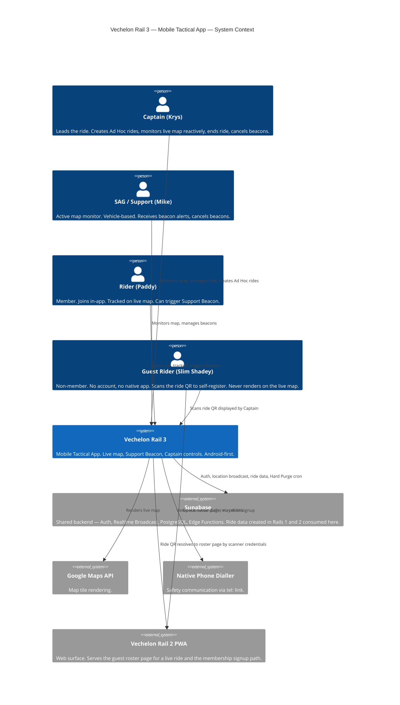

[Vechelon Rail 3] Pillar I: The Charter (v1.1.0)
Project: Vechelon Rail 3 — Mobile Tactical | Current Version: v1.1.0 | Last Sync Date: 2026-09-08 | Status: COMMITTED

---

## Change Log
| Version | Date | Time | MACD Action | Decision | Trio Lead |
|---|---|---|---|---|---|
| v0.1.0 | 2026-05-12 | — | ADD | Initialized Rail 3 Pillar I shell | TPM |
| v1.0.0 | 2026-05-12 | — | ADD | Completed all TBD sections. Promoted DRAFT → COMMITTED | TPM |
| v1.1.0 | 2026-09-08 | — | CHANGE | G33 Charter pass (MACD session). §3 twelve hour ride-duration envelope added as a design bound (slate 1). §4 Guest persona added; Rider and Guest split; Krys QR clause rewritten (native app, credential-routed, not a member join path); Slim Shadey rewritten per R-GUEST as amended by D-QR-1 to D-QR-5. §6 C1 bumped to v1.1.0: rider and guest actors split, Rail 2 PWA added as System_Ext, three guest relationships added. Amendment Protocol assessed and not triggered; Brain-originated change taken as straight MACD. | TPM |

---

## §1. Mission Statement

Rail 3 is the live ride surface — the third and final surface of Vechelon. Rails 1 and 2 build the ride: the schedule, the route, the roster, the QR. Rail 3 executes it. Reading from the same Supabase backend, Rail 3 activates the moment a ride goes live — live tracking so the Captain and SAG always know where the group is, a one-tap Support Beacon for riders who need help, and ride controls from the saddle. The safety layer that turns a group of cyclists into a coordinated peloton.

This is the differentiator Vechelon exists to deliver.

---

## §2. Problem Statement

Group cycling has no real-time safety layer. When a rider drops off the back, the Captain doesn't know until someone calls it in — or doesn't. When a rider needs help, there's no reliable way to signal position fast. Coordination during a live ride means phone calls, WhatsApp messages, and eyes off the road.

Rails 1 and 2 solve the planning problem. Rail 3 solves what happens on the road — where things go wrong and reaction time matters. Without it, Vechelon is a scheduling tool. With it, it's a safety platform.

---

## §3. Constraints

### Platform Constraints
- Production stack: React Native Expo (managed workflow)
- PoC: React Native Expo, Android only, Expo Development Build (sideloaded APK)
- iOS: Excluded from PoC. Rail 3b post Android validation.
- iOS exclusion rationale: Apple mandates WebKit for all iOS browsers. WebKit does not expose the Geolocation API to Service Workers. Background GPS is impossible in any iOS PWA regardless of browser choice. This is a hard constraint, not a preference.

### Operational Constraints
- Ride duration envelope: twelve hours. Rail 3 sizing, retention, and lifecycle machinery are designed to hold for a single continuous ride of up to twelve hours. The envelope is a design bound that downstream mechanisms must satisfy, not a system-enforced cap on ride length.

### Inherited Constraints (by reference — not restated)
- → Rail 1 Pillar I: Supabase architecture, auth, RLS
- → Rail 1 Pillar I: $0 operating cost target
- → Rail 1 Pillar I: 4-hour Hard Purge (applies to all Rail 3 location data)
- → Rail 1 Pillar I: License Bringer AI model
- → Set 3 Pillars: Multi-tenancy — Rail 3 live rides operate within tenant boundary, full RLS isolation maintained

---

## §4. User Personas

→ Base personas inherited by reference from Rail 1 Pillar I.

Rail 3 active personas during a live ride:

| Persona | Role | Rail 3 Capability |
|---|---|---|
| Captain | Leads the ride | Full peloton map, mobile controls, ride management |
| Support | SAG / sweep | Full peloton map, receives beacon alerts |
| Rider | Active participant | Tracked on peloton map, can trigger Support Beacon |
| Guest | Non-member ride participant | Roster presence only. No native app. Views the PWA roster page for their ride. Never renders on the fleet map |

**Krys — The Ride Captain**
Primary device is in their back pocket or jersey — not mounted. Krys is not expected to actively monitor the app during the ride. Rail 3 on Captain is primarily reactive: check the map when something feels off, trigger end ride when done, create an Ad Hoc ride when no scheduled ride exists. Krys carries the ride QR in the Rail 3 app and displays it on the phone to authorise someone onto the ride. The code routes by the scanner's credentials, so a scanner without an account reaches guest self-registration. QR is not a member join path; members join in-app.

**Mike — The SAG (Support)**
The active map monitor. Mike is in a vehicle and has eyes on the screen in a way Krys doesn't. Glanceable UI is non-negotiable — large icons, readable at a distance. Mike receives Support Beacon alerts and can cancel them. Mike cannot end a ride.

**Paddy — Rider**
Minimal interaction during the ride. Joins in-app. Sees their own position as a blue dot and the Captain and SAG icons only. Primary action available: trigger Support Beacon. Everything else is passive; they are being tracked, not managing.

**Slim Shadey — Guest Rider**
Portal-side participant only. No account, no native app. Self-registers by scanning the ride QR the Captain displays: name and phone mandatory, email optional. Sees the PWA roster page for their ride and nothing else. Never renders on the fleet map, produces no position, and has no Support Beacon. Contact reach is two-way by phone through the roster row.

Native app access is a benefit of club membership. Two conversion paths are open and neither gates participation: a signup email sent where the guest supplied an address, and a signup link on the PWA roster page. Email confirmation is never a condition of joining or riding. A guest who converts through registration and affiliation bears that friction by election. A guest who does not remains a guest for the ride, undegraded.

Any email held against a guest record is a conversion payload, not an identity. It authorises nothing and creates no account, per R3-60.

---

## §5. Domain Glossary Additions (Rail 3)

→ Base glossary inherited by reference from Rail 1 Pillar I.

| Term | Definition |
|---|---|
| Live Map | The real-time map showing all active rider positions during a ride |
| Support Beacon | One-tap distress signal sent by a rider, alerting Captain and Support with location snapshot |
| Rider State | The tactical condition of a ride participant as determined by movement and connectivity signals. One of: Active, Stopped, Inactive, or Dark. Drives icon rendering on the live map |
| Edge Indicator | A directional arrow rendered at the boundary of the visible map viewport, pointing toward the ride's finish point when the finish is outside the current view. Calculated using the Haversine formula. No routing engine required |
| Background GPS | GPS tracking that continues when a device screen is locked |
| Expo Development Build | Custom native APK with full capabilities, distributed via sideload — PoC only |
| Supabase Broadcast | Ephemeral WebSocket channel — no database write — used for real-time location fan-out |
| OEM Battery Optimisation | Aggressive background process killing on Samsung, Xiaomi, Huawei devices outside Google's standard |

---

## §6. C1 System Context Diagram

