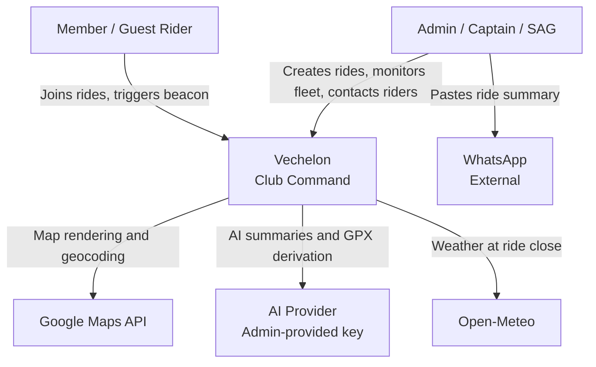

# Vechelon | Pillar I: The Charter (v1.2.0)

Project: Vechelon | Current Version: v1.2.0 | Last Sync Date: 2026-04-08 | Status: COMMITTED

---

## 1. Mission Statement

Vechelon transforms the group ride from a series of individual GPS tracks into a unified tactical unit. It is a Tactical Command Centre — not a social fitness network — that operates exclusively in the 2–6 hour window when coordination and safety are the only things that matter.

Vechelon wins by owning the Live Ride. Strava and Garmin have already won social validation and performance archiving. Vechelon wins by ensuring no rider is left behind, lost, or uncontactable during the ride itself.

**Tagline:** Club Command

---

## 2. The North Star Constraints

These are hard constraints. Any feature that violates them is killed before documentation.

| Constraint | Rule |
|---|---|
| $0 Operating Cost | The platform must run on free-tier infrastructure for a single active club MVP. Paid services require explicit PM approval and Ledger entry. |
| Zero-Friction Participation | Guests must be able to join a live ride without a prior account, app download, or email verification. |
| Privacy as Product | All location data and guest session data are purged 4 hours after ride close. This is non-negotiable. |
| Tactical Focus | Vechelon covers the Live Ride only. Pre-ride planning and post-ride performance archiving are deliberately out of scope. |
| No In-App Communication | All voice and text coordination uses the rider's native phone dialler and WhatsApp. Vechelon surfaces contact details; it does not carry messages. |

---

## 3. The Problem Statement

Cycling clubs operate across three fragmented tools:

- **Strava** — performance tracking and social validation, but no tactical live awareness
- **WhatsApp** — real-time communication, but ephemeral and noisy; critical information gets buried
- **Nothing** — live group safety, fleet visibility, and support van coordination have no dedicated tooling

The result: Ride Captains cannot see their fleet. Support vans cannot locate dropped riders efficiently. Guests join rides with no safety net. Important club information disappears into WhatsApp scroll.

Vechelon closes the tactical gap — the period when the ride is active and every decision is time-critical.

---

## 4. The Five Outcome Pillars

These are Vechelon's core value propositions, derived from real club pain points.

| # | Problem | Vechelon Response | Outcome |
|---|---|---|---|
| 01 | Planning — newer riders are unfamiliar with the course | Admin pins an official GPX route; start/finish and waypoints are broadcast to all riders | Consistent group rides with shared spatial awareness |
| 02 | Rollout — pace differences fragment the group instantly | Single-tap join keeps every rider on the tactical roster regardless of speed | Unified group presence from the first pedal stroke |
| 03 | The Ride — high-speed pace changes make group position impossible to gauge | Real-time state mapping: Active, Stopped (2-min), Inactive (5-min), Dark (15-min) | Relative positioning maintained even in mass-participation events |
| 04 | Support — vans cannot efficiently locate dropped or distressed riders | Real-time tactical icons; Support Beacon toggle; one-tap native dial | Rapid, targeted assistance with precise situational mapping |
| 05 | Aftermath — long-term GPS storage creates privacy risk | Automated purge of all tactical data 4 hours post-ride | Zero-Footprint Safety — club history preserved, sensitive tracks erased |

---

## 5. User Personas

### 5.1 Fab — The Club Admin
- **Who:** The primary organiser for the club. Manages ride creation, series scheduling, and club membership. May or may not ride.
- **Device context:** Desktop for ride creation and series management. Mobile during live rides.
- **Core needs:** Create and manage rides efficiently. Push ride info to WhatsApp. Monitor live fleet during events.
- **Veto power:** Mission Veto — kills anything that adds administrative friction or scope creep.

### 5.2 The Ride Captain
- **Who:** An elevated Member assigned to a specific ride. Responsible for group cohesion and safety during the live ride.
- **Device context:** Mobile, often phone mounted on handlebars. May use a secondary device for calls.
- **Core needs:** Fleet visibility. Instant access to all rider contact details. Ability to identify and respond to Inactive or Beaconing riders.
- **Special authority:** Can create Ad Hoc rides. Can end a ride. Can cancel a rider's Support Beacon.

### 5.3 The Support Van (SAG)
- **Who:** A designated support person, typically in a vehicle, assigned to a specific ride. Almost certainly a different person from the Captain. Optional — primarily relevant on long rides.
- **Device context:** Mobile or tablet. Hands-free context — UI must be readable at a glance.
- **Core needs:** Global fleet visibility. Always visible to all active riders as a Primary Beacon. Rapid contact with any rider.
- **Special authority:** Always visible to all riders regardless of position. Can cancel a rider's Support Beacon.
- **MVP constraint:** SAG configured before ride starts. Cannot be reassigned mid-ride. Schema supports multiple SAG records per ride.

### 5.4 The Member Rider
- **Who:** A verified club member with an Active & Affiliated account.
- **Device context:** Mobile during rides. May use a dedicated cycling computer (Garmin, Wahoo) for navigation — Vechelon is the safety layer, not the nav tool.
- **Core needs:** RSVP to rides. Join active rides. See Captain and Support Van position and contact details. Trigger Support Beacon if needed.
- **Visibility:** Can see Captain and Support Van only — not other riders' positions.

### 5.5 The Guest Rider
- **Who:** An unverified participant who joins via QR code at the parking lot. May provide optional name and phone number.
- **Device context:** Mobile. Often a first-time experience with Vechelon.
- **Core needs:** Zero-friction ride entry. Appear on Captain's map immediately. Access to Captain and Support Van contact details.
- **Visibility:** Same as Member Rider — Captain and Support Van only.
- **Account path:** Guest account persists post-ride. Can be converted to full Member at any time. Ride history carries forward if cookie match exists.

### 5.6 The Observer (Post-MVP)
- **Who:** A non-riding participant — family member, team manager — who monitors the live map without participating.
- **Status:** Deliberately deferred. Not in MVP scope.

---

## 6. Domain Glossary

| Term | Definition |
|---|---|
| Active Ride | The period between a ride going Active and being closed by Admin/Captain or midnight UTC auto-close |
| Support Beacon | A lightweight rider-triggered visual SOS that changes the rider's map icon to a pulsing high-visibility state on Captain and Support Van views |
| Hard Purge | The automated deletion of all location data and guest session data exactly 4 hours after a ride is closed |
| Zero-Footprint Safety | The privacy outcome of the Hard Purge — sensitive GPS tracks erased, club history (summary, participant count) preserved |
| Fleet Heartbeat | The real-time collection of active rider pings visible to Captain and Support Van |
| Tactical Directory | How Vechelon surfaces contact info — it shows the number and provides a dial button; all communication happens outside the app |
| Guest [ID] | A guest ride participant who has not provided name or phone — visible on the Captain's map as a tracked but unidentified unit. The distinction is membership status, not data richness. |
| Shadow Account | A lightweight browser-cookie-based guest record that persists post-ride and can be converted to a full Member account |
| Halo State | Marketing language only (from vechelon.productdelivered.ca). Not used in product UI. Corresponds to the Stopped rider state. |
| Fade State | Marketing language only (from vechelon.productdelivered.ca). Not used in product UI. Corresponds to the Inactive rider state. |
| Series | A set of recurring ride instances linked by a series_id UUID, each an independent database record |
| Route Library | The admin-curated collection of official route files associated with a club tenant |
| Home Base | The Admin Desktop surface of Vechelon — full-featured React web app for ride management, calendar, series creator, route library, member directory, and club info. Desktop-first. |
| Rider Feed | The mobile-optimised surface for Member and Guest ride participants — chronological feed, RSVP/Join, route library, personal ride history. |
| The Hands | The coding agent (Claude Code, Gemini CLI, or human developer) who builds from the Bedrock |
| Tenant | A single club instance on the Vechelon platform. MVP = one active tenant (Racer Sportif) |
| Bedrock | The committed documentation set (Pillars I–IV plus optional Pillar V Amendments) that The Hands build from |

---

## 7. Key Deliverables (MVP Scope)

| Deliverable | Description | Phase |
|---|---|---|
| Live Tactical Map | Real-time fleet visibility for Captain and SAG. State-aware ride participant icons. | MVP — Mobile track |
| Guest QR Join | Zero-friction ride entry via QR scan. No account required. | MVP |
| Member Join / RSVP | In-app join button. State-aware: "RSVP" pre-ride, "Join" when Active. | MVP |
| Support Beacon | Ride participant-triggered visual SOS. Cancellable by Rider, Captain, or SAG. | MVP — Mobile track |
| Ride Series Creator | Admin bulk-creates recurring ride schedules. Desktop-first. | MVP — Admin Desktop |
| Ad Hoc Ride Creation | Captain/Admin creates an unscheduled ride in the parking lot. | MVP — Captain Mobile |
| WhatsApp Bridge (Outbound) | AI-generated pre-ride and post-ride summaries; Copy to Clipboard for WhatsApp paste. | MVP |
| Route Library | Admin-curated route upload, browsable by all members. | MVP |
| Hard Purge | Automated 4-hour post-ride deletion of location and ride participant session data. | MVP |
| Admin Desktop Home Base | Full calendar view, ride management, series creator, member directory, club info. Desktop-first React web app. | MVP — Admin Desktop |
| Rider Mobile Feed | Chronological ride feed, RSVP/Join, route library, personal ride history. Mobile-first. | MVP — Mobile track |
| Multi-Tenancy Foundation | Per-tenant branding via CSS variables. MVP = one active tenant (Racer Sportif). | MVP |
| iOS Mobile App | React Native iOS build after Android validation. App Store submission. | Post-MVP |
| Observer Role | Non-riding map monitor for family members, team managers. | Post-MVP |
| Multiple Simultaneous Rides | More than one active ride per club at a time. | Post-MVP |
| In-App Notifications | Email / push notification system. | Post-MVP |
| Self-Serve Admin Branding Portal | Non-technical club admin configures logo, colours, slug. | Post-MVP |
| Geofencing | Join restrictions based on proximity to route. | Post-MVP |
| WhatsApp Deep-Link Sharing | Direct link from WhatsApp into active ride join flow. | Post-MVP |
| Strava Integration | Individual activity sync, personal progress dashboards. | Post-MVP |

---

## 8. System Context Diagram (C1)

---

## 9. Non-Functional Requirements

| Requirement | Rule |
|---|---|
| Desktop-First (Admin) | Admin Desktop Home Base must be fully functional in desktop browser (Chrome/Safari). Calendar, ride management, and series creator are desktop experiences. |
| Mobile-First (Rider) | All rider-facing UI must be fully functional on a mobile device. React Native — no browser limitation. |
| Zero App Download (Admin) | Admin Desktop works in browser — no app store install required. |
| Thumb-Friendly | All tactical actions on mobile reachable with one thumb. Bottom Sheet pattern for contact/detail views. |
| Privacy by Design | Location and PII collected only for ride safety. Purged automatically. No permanent GPS archive. |
| $0 Infrastructure | Free-tier Supabase, Google Maps ($200/month credit), Open-Meteo (free). Cost escape valve: OSM + Leaflet if Google Maps credit exceeded. |
| Google Maps Billing Alert | Hard operational rule: $150 billing alert configured in Google Cloud Console. |
| Single Active Ride | MVP supports one active ride per club at a time. |
| Auth Pattern | LLD decision for The Hands — recommendation: Supabase Magic Link. |

---

## 10. Test Club — Tenant 1

**Club Name:** Racer Sportif
**Founded:** 1978, Toronto, Ontario
**Locations:** 2214 Bloor St W, Toronto / 151 Robinson St, Oakville
**Disciplines:** Road, Gravel, Track, Triathlon
**Community:** Organised club rides, youth development, charity events
**Brand assets:** To be seeded manually by The Hands at initialisation. Reference: vechelon.productdelivered.ca for Vechelon platform brand. Racer Sportif brand assets provided by club admin.

---

## Change Log

| Version | Date | Time (UTC) | Action | Decision | Lead |
|---|---|---|---|---|---|
| v1.0.0 | 2026-04-06 | 00:00 | ADD | Pillar I initialised from Phase 0 inventory and gap interview | TPM |
| v1.1.0 | 2026-04-08 | 11:00 | CHANGE | C1 diagram simplified to standard Mermaid flowchart. AI provider reference updated to multi-provider. SAG persona MVP constraint corrected. Key Deliverables updated for three-surface architecture. Halo/Fade noted as marketing language only. Home Base and Rider Feed added as distinct glossary terms. NFRs updated for three-surface architecture. | TPM |
| v1.2.0 | 2026-04-08 | 11:15 | CHANGE | Section 4 Five Outcome Pillars — state machine timings corrected (Stopped 2-min, Inactive 5-min, Dark 15-min). Dark state added. | TPM |
