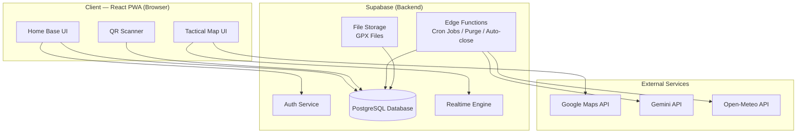
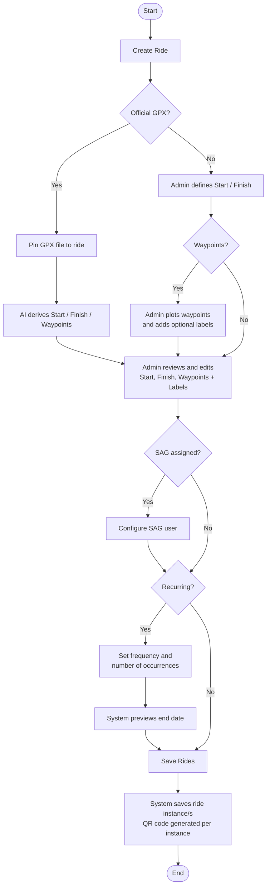
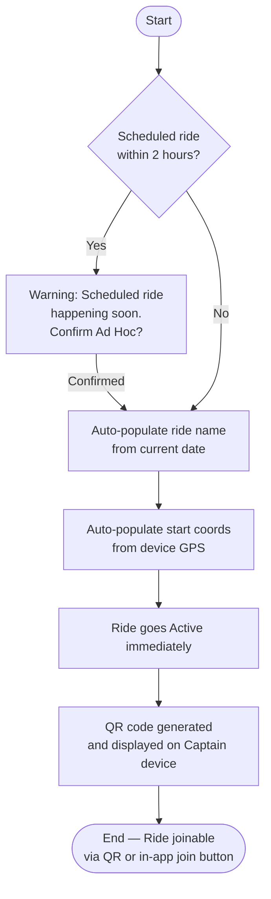
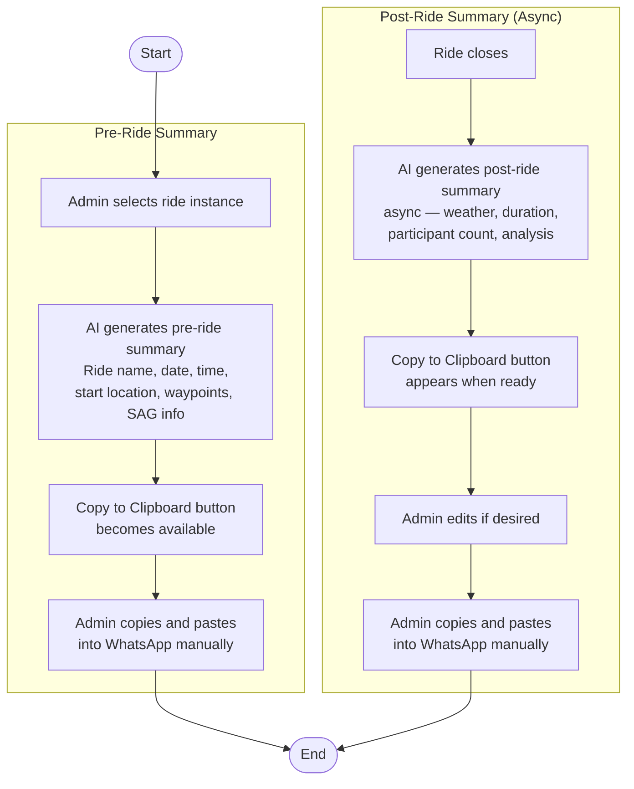
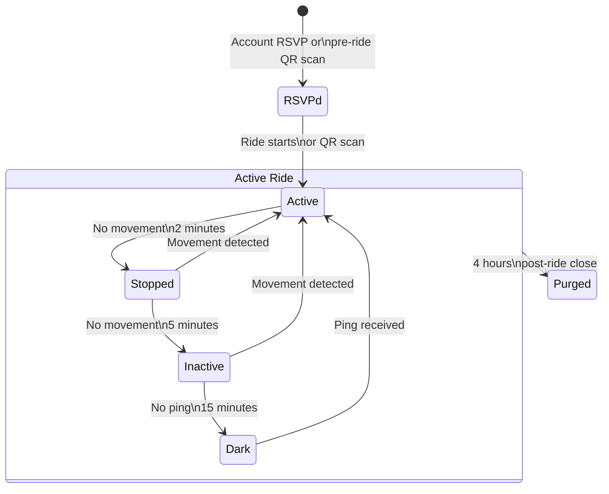
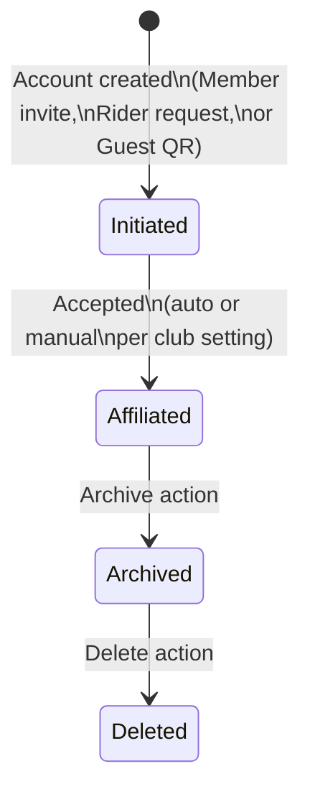
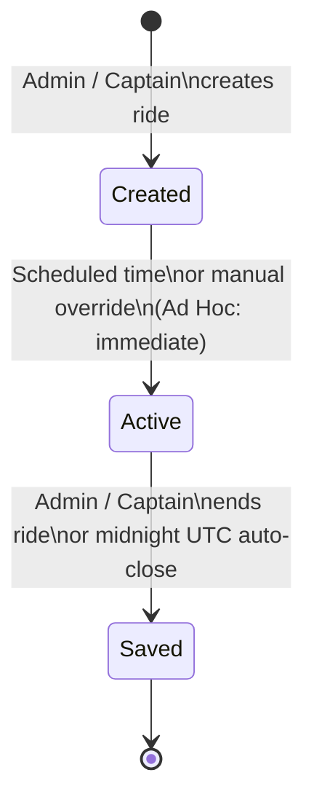

# Vechelon | Pillar II: The Specs (v1.0.0)

Project: Vechelon | Current Version: v1.0.0 | Last Sync Date: 2026-04-06 | Status: DRAFT

---

## 1. Product Architecture Overview

Vechelon is a Progressive Web App (PWA) built on a free-tier stack. It operates as two distinct surfaces:

- **Home Base** — the pre/post-ride administrative and club management layer
- **The Live Ride** — the tactical real-time map layer, active only during a ride session

The system is multi-tenant by design from Day 1. MVP operates with one active tenant (Racer Sportif). Additional tenants are onboarded via manual database seeding until the self-serve admin portal is built (post-MVP).

---

## 2. Technology Stack

| Layer | Technology | Rationale |
|---|---|---|
| Frontend | React PWA | Zero-friction, no app store, cross-platform |
| Backend / Database | Supabase (PostgreSQL) | Free tier, Auth, Realtime, Storage, Edge Functions |
| Map Rendering | Google Maps JavaScript API | UX familiarity, geocoding quality |
| Admin Geocoding | Google Maps Geocoding API | Address-to-coords for ride creation (admin only) |
| AI Features | Gemini API (admin-provided key) | License Bringer model — $0 platform cost |
| Weather | Open-Meteo API | Free, no key required, called at ride close |
| Auth | Supabase Auth | Magic Link recommended (LLD decision for The Hands) |
| Realtime Pings | Supabase Realtime | Fleet heartbeat during live ride |
| File Storage | Supabase Storage | GPX file uploads |
| Scheduled Jobs | Supabase Edge Functions (Cron) | Midnight auto-close, 4-hour purge |

**Cost Constraint:** Google Maps $200/month credit. Hard operational rule: $150 billing alert configured in Google Cloud Console.

**Cost Escape Valve (Pillar IV):** If Google Maps credit is exceeded post-MVP scale, pivot to OpenStreetMap + Leaflet.js + Nominatim. No schema change required.

---

## 3. Container Diagram (C2)



---

## 4. Data Schema

### 4.1 tenants
Club-level configuration. One record per club.

| Field | Type | Notes |
|---|---|---|
| id | UUID PK | |
| name | Text | e.g. "Racer Sportif" |
| slug | Text Unique | URL identifier e.g. "racer-sportif" |
| primary_color | Text | Hex code — seeded manually MVP |
| accent_color | Text | Hex code — seeded manually MVP |
| logo_url | Text | Link to club logo asset |
| gemini_api_key | Text Encrypted | Admin-provided — License Bringer model |
| enrollment_mode | Enum | 'open' / 'manual' |
| created_at | Timestamp | |

### 4.2 accounts
One record per person. Single-user accounts only — no shared accounts.

| Field | Type | Notes |
|---|---|---|
| id | UUID PK | Links to Supabase Auth |
| tenant_id | UUID FK → tenants | |
| email | Text Required | Member / Admin only |
| phone | Text Required | Member / Admin only |
| name | Text | |
| role | Enum | 'admin' / 'member' / 'guest' |
| status | Enum | 'initiated' / 'affiliated' / 'archived' / 'deleted' |
| guest_cookie_id | Text | Browser cookie reference for returning guest matching |
| created_at | Timestamp | |

**Account State Machine:**
`Initiated → [Accept] → Active & Affiliated → [Archive] → Archived → [Delete] → Deleted`

- Acceptance is automatic (open enrollment) or manual (admin approval) per tenant setting
- Guest accounts enter at Initiated. Same state machine as Member — lighter initial data
- Guest ride history carries forward on conversion if cookie match exists

### 4.3 rides
One record per ride instance.

| Field | Type | Notes |
|---|---|---|
| id | UUID PK | |
| tenant_id | UUID FK → tenants | |
| series_id | UUID Nullable | Links recurring instances |
| name | Text | Auto-generated for Ad Hoc: "Tuesday Ride — Apr 6" |
| type | Enum | 'scheduled' / 'adhoc' |
| status | Enum | 'created' / 'active' / 'saved' |
| start_coords | Point | Latitude / Longitude |
| start_label | Text Nullable | Optional admin label |
| finish_coords | Point Nullable | Null for Ad Hoc at creation — captured at ride end |
| finish_label | Text Nullable | Optional admin label |
| gpx_path | Text Nullable | Path to GPX file in Supabase Storage |
| scheduled_start | Timestamp Nullable | Null for Ad Hoc |
| actual_start | Timestamp | When ride went Active |
| actual_end | Timestamp Nullable | When ride was closed |
| auto_closed | Boolean | True if midnight UTC trigger fired |
| qr_code | Text | Unique QR payload for this ride instance |
| group_id | UUID Nullable | Stub for post-MVP sub-group Captain feature |
| created_by | UUID FK → accounts | |
| created_at | Timestamp | |

**Ride State Machine:**
`Created → [scheduled time or admin/captain override] → Active → [admin/captain end or midnight UTC] → Saved`

- Scheduled rides auto-activate at scheduled_start time
- Ad Hoc rides go Active immediately on creation
- Midnight UTC auto-close sets auto_closed = true and flags the post-ride summary accordingly
- Admin or Ride Captain can end a ride at any time

### 4.4 ride_support
Support assignment per ride. One or more records per ride (MVP: no mid-ride reassignment).

| Field | Type | Notes |
|---|---|---|
| id | UUID PK | |
| ride_id | UUID FK → rides | |
| account_id | UUID FK → accounts | The support person |
| vehicle_description | Text Nullable | e.g. "Silver Sprinter — BIKES1" |
| assigned_at | Timestamp | |

**MVP constraint:** Support configured before ride starts. Cannot be reassigned mid-ride.
**Post-MVP:** Multiple support records per ride, mid-ride reassignment.

### 4.5 waypoints
Waypoints associated with a ride. Order-indexed.

| Field | Type | Notes |
|---|---|---|
| id | UUID PK | |
| ride_id | UUID FK → rides | |
| coords | Point | Required — AI-derived from GPX or admin-plotted |
| label | Text Nullable | Optional free-text e.g. "Coffee", "Lunch", "Beer" |
| order_index | Integer | Display order on map |

### 4.6 route_library
Admin-curated official routes for the club.

| Field | Type | Notes |
|---|---|---|
| id | UUID PK | |
| tenant_id | UUID FK → tenants | |
| name | Text | e.g. "Forks of the Credit Loop" |
| gpx_path | Text | Path in Supabase Storage |
| distance_km | Float Nullable | |
| elevation_gain_m | Integer Nullable | |
| created_by | UUID FK → accounts | Admin only |
| created_at | Timestamp | |

**Access:** Browsable and GPX downloadable by all Active & Affiliated members.
**Admin only:** Upload and management.

### 4.7 ride_participants
Session object. Exists for the duration of a ride. Purged 4 hours post-close.

| Field | Type | Notes |
|---|---|---|
| id | UUID PK | |
| ride_id | UUID FK → rides | |
| account_id | UUID FK → accounts Nullable | Null for fully anonymous guests |
| guest_cookie_id | Text Nullable | For anonymous guest tracking |
| display_name | Text Nullable | Provided by guest, or account name |
| phone | Text Nullable | Provided by guest, or account phone |
| role | Enum | 'member' / 'captain' / 'support' / 'guest' |
| status | Enum | 'rsvpd' / 'active' / 'stopped' / 'inactive' / 'dark' / 'purged' |
| beacon_active | Boolean | Support Beacon SOS toggle |
| last_lat | Float Nullable | |
| last_long | Float Nullable | |
| last_ping | Timestamp Nullable | |
| joined_at | Timestamp | |
| group_id | UUID Nullable | Stub for post-MVP sub-group Captain feature |

**Rider State Machine:**
`RSVP'd → [Start or QR] → Active → Stopped → Inactive → Dark → [timer] → Purged`

| State | Trigger | Signal |
|---|---|---|
| RSVP'd | Account RSVP or QR scan pre-ride | — |
| Active | Ride starts or QR scan during Active ride | Present, moving |
| Stopped | No movement for 2 minutes | Present, stationary |
| Inactive | No movement for 5 minutes | Present, stationary |
| Dark | No ping received for 15 minutes | Lost |
| Purged | 4 hours post-ride close | — |

**State thresholds:** Admin-configurable per ride. Defaults: 2m / 5m / 15m.

**Visibility rules:**
- Captain and SAG: see all riders in fleet
- Member / Guest riders: see Captain and SAG only
- Phone numbers: visible to Captain and SAG for all riders. Riders see Captain and SAG numbers only.

**Contact mechanism:** Phone number displayed in large readable format. Native dial button (tel: link). No in-app messaging.

### 4.8 ride_summaries
Post-ride summary generated by AI. Retained after purge.

| Field | Type | Notes |
|---|---|---|
| id | UUID PK | |
| ride_id | UUID FK → rides | |
| pre_ride_summary | Text | Generated at ride creation |
| post_ride_summary | Text Nullable | Generated at ride close — async |
| weather_data | JSONB Nullable | From Open-Meteo at ride close coords |
| participant_count | Integer | Retained post-purge |
| auto_closed | Boolean | Flagged if midnight trigger fired |
| generated_at | Timestamp | |

---

## 5. Admin Ride Creation Flow

### 5.1 Scheduled Ride Creation



**Notes:**
- GPX AI derivation failure falls through to manual path gracefully — no hard block
- All fields on the review screen are editable regardless of path (GPX or manual)
- Waypoint labels are optional free-text (e.g. "Coffee", "Lunch", "Beer")
- Start and Finish both have optional labels
- Recurring MVP: edit applies to selected instance only
- QR code generated per ride instance at save time

### 5.2 Ad Hoc Ride Creation



**Notes:**
- Finish coords captured when Admin/Captain ends the ride — not at creation
- No GPX, no waypoints, no recurring, no SAG on Ad Hoc rides
- SAG does not apply to Ad Hoc rides

### 5.3 Admin Edits Ride Instance

**Pre-Active (Created state):** All fields editable — GPX, waypoints/labels, SAG assignment, recurring settings, start time.

**Active state:** Limited edits only — SAG assignment, waypoint labels. GPX and start/finish locked.

**Recurring series:** Edit applies to selected instance only (MVP). Series-wide edit is post-MVP.

### 5.4 WhatsApp Outbound Flow



**Notes:**
- Pre-ride and post-ride summaries are separate flows with separate clipboard buttons
- End Ride and Get Post-Ride Summary are distinct actions — summary is async
- Auto-closed rides: post-ride summary flagged as "This ride was auto-closed"
- Weather data sourced from Open-Meteo using start coords at ride close time

---

## 6. Rider State Machine Diagram



---

## 7. Account State Machine Diagram



---

## 8. Ride State Machine Diagram



---

## 9. UX & Interface Specifications

### 9.1 Core UX Principles
- **Thumb-Friendly:** All tactical actions reachable with one thumb. Bottom Sheet pattern for contact and detail views.
- **Zero Labels on State:** Rider states are communicated through icon differentiation only — no text labels on the live map.
- **Passive Participation:** The app does the work silently. Riders are not prompted unless action is required.
- **Tactical Directory:** Contact details are displayed, not transmitted. The app hands off to native phone hardware.

### 9.2 Map Visual Hierarchy

| Actor | Icon Style | Visible To |
|---|---|---|
| Member (Active) | Solid filled icon | Captain + SAG only |
| Member (Stopped) | Solid icon, reduced opacity | Captain + SAG only |
| Member (Inactive) | Hollow icon | Captain + SAG only |
| Member (Dark) | Greyed icon, last known position | Captain + SAG only |
| Guest (any state) | Visually distinct from Member (e.g. different shape or colour ring) | Captain + SAG only |
| Pending Member | Subtle visual distinction from Affiliated member | Captain + SAG only |
| Captain | High-visibility icon | All riders |
| SAG | Primary Beacon — always visible | All riders |
| Support Beacon active | Pulsing high-visibility overlay on rider icon | Captain + SAG only |

### 9.3 Bottom Sheet — Contact Triage
Triggered by tapping any Captain or SAG icon (riders), or any rider icon (Captain/SAG).

| Element | Detail |
|---|---|
| Name & Status | Display name + current rider state |
| Phone Number | Large monospace format — readable at a glance for cross-device dialling |
| Copy Number | Clipboard icon for manual entry on secondary device |
| Primary Action | Full-width "Dial" button — opens native dialler via tel: link |

### 9.4 Edge Directional Indicators
When a finish point exists that differs from the start, an arrow overlay points toward the off-screen finish. Calculated using Haversine formula — no routing engine required. $0 cost.

### 9.5 Join / RSVP Flow
Same button, state-aware label:
- Ride is Created → button reads **"RSVP"**
- Ride is Active → button reads **"Join"**

**Guest join (QR only):** Prompted for optional name and phone. Can skip both. Appears on Captain's map immediately regardless of info provided.

**Member join:** In-app button. No QR required (though QR also works).

**Ride visibility:**
- Public clubs: rides visible to non-members
- Private clubs: rides visible to Active & Affiliated members only
- Configurable per tenant

### 9.6 Home Base Surfaces

| Surface | Access | Description |
|---|---|---|
| Club Calendar / Series Feed | All members | Upcoming rides chronologically. RSVP / Join button per ride. |
| Route Library | All members | Browse and download admin-curated GPX routes |
| Ride Management | Admin / Captain | Create, edit, manage ride instances and series |
| Member Directory | Names: all members. Contact details: Admin / Captain only | Club member list |
| Club Info | All members | Club name, description, logo, contact |
| Personal Ride History | Own account | Own participation history. Click ride → participant list (names only) |

---

## 10. Branding & Multi-Tenancy

### 10.1 Tenant Branding Injection
At app initialisation, the tenant_id from the URL slug fetches the brand config from the tenants table and injects CSS custom properties into the :root element.

```css
:root {
  --brand-primary: [tenant primary_color];
  --brand-accent: [tenant accent_color];
  --brand-logo: url('[tenant logo_url]');
}
```

### 10.2 MVP Branding Setup
Manual database seed by The Hands. No admin UI for branding in MVP.

**Tenant 1 — Racer Sportif:**
- Brand assets: provided by club admin at initialisation
- Vechelon platform brand: reference vechelon.productdelivered.ca

### 10.3 Post-MVP
Self-serve branding portal for non-technical club admins. Configurable: logo upload, primary/accent colour picker, club name, URL slug. No live preview required at Phase 2.

---

## 11. Security & Privacy

| Rule | Implementation |
|---|---|
| Row Level Security | Supabase RLS — users can only access data where tenant_id matches their own |
| Phone number visibility | API-level enforcement — Captain/SAG only for rider numbers; riders see Captain/SAG only |
| Guest data | Session-scoped. Account record persists. Location data purged at 4-hour mark. |
| Hard Purge | Supabase Edge Function cron — deletes ride_participants location fields 4 hours post-ride close |
| Gemini API key | Stored encrypted in tenants table. Never exposed to client. |
| Auth | Supabase Auth. Magic Link recommended. LLD decision for The Hands. |

---

## 12. Sprint 0 Tasks (LLD Unknowns for The Hands)

| # | Task | Context |
|---|---|---|
| S0-01 | Auth pattern confirmation | Magic Link recommended. Confirm against Supabase Auth capabilities and club admin UX expectations. |
| S0-02 | Google Maps API scope | Confirm which specific APIs are enabled (JavaScript API + Geocoding only). Validate $200 credit adequacy for MVP load. |
| S0-03 | Supabase Realtime battery impact | Test heartbeat ping frequency on mobile browsers. Confirm acceptable battery drain for 2–6 hour ride duration. |
| S0-04 | GPX parsing library | Identify and validate a client-side or Edge Function GPX parser compatible with Gemini AI derivation flow. |
| S0-05 | QR code generation library | Select and validate QR generation approach within React PWA. |
| S0-06 | Open-Meteo integration | Confirm API response structure and implement weather fetch at ride close coordinates. |
| S0-07 | RLS policy design | Design and test Row Level Security policies for all tables — especially ride_participants visibility rules. |
| S0-08 | Midnight UTC cron | Implement and test Supabase Edge Function cron for auto-close trigger. |
| S0-09 | 4-hour purge cron | Implement and test Supabase Edge Function for Hard Purge. Confirm location field deletion without removing ride_summaries. |

---

## Change Log

| Version | Date | Time (UTC) | Action | Decision | Lead |
|---|---|---|---|---|---|
| v1.0.0 | 2026-04-06 | 00:00 | ADD | Pillar II initialised from Phase 0 inventory and gap interview | TPM |
