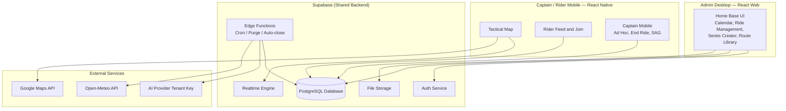
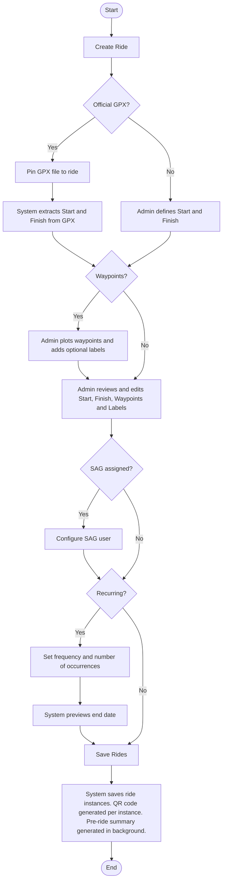
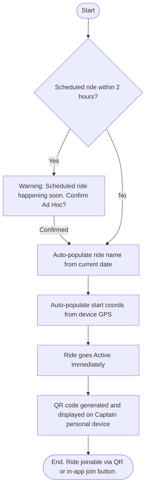
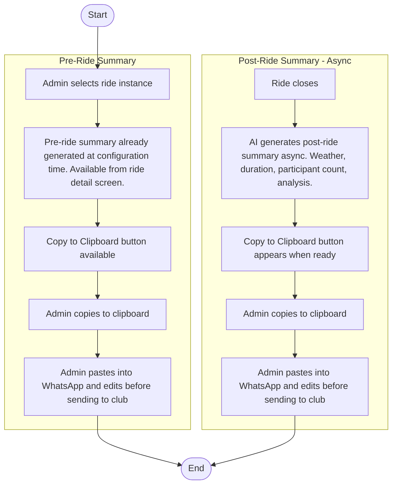
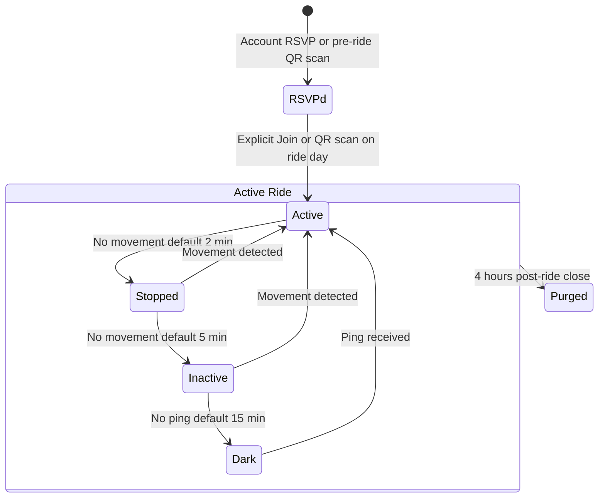
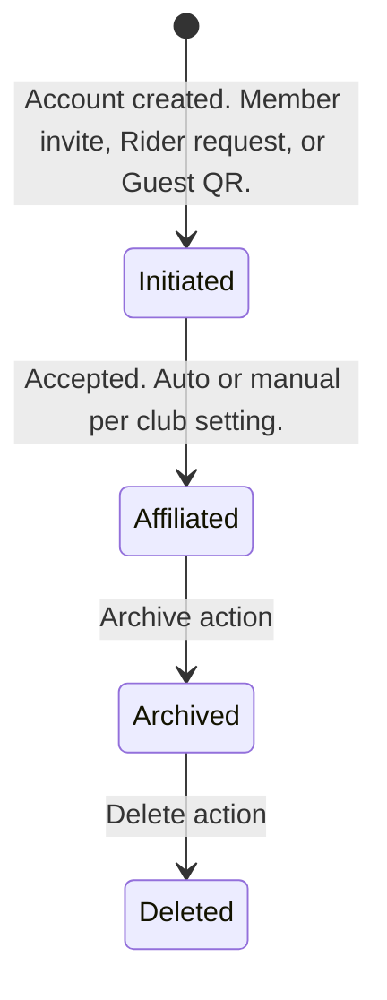
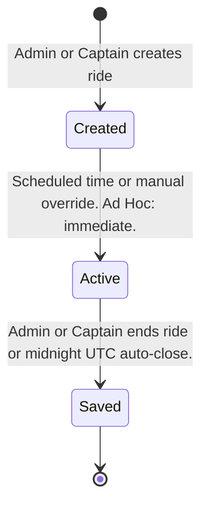

# Vechelon | Pillar II: The Specs (v1.3.0)

Project: Vechelon | Current Version: v1.3.0 | Last Sync Date: 2026-04-08 | Status: COMMITTED

---

## 1. Product Architecture Overview

Vechelon operates across three distinct surfaces sharing a single Supabase backend:

- **Admin Desktop Web (React)** — full ride management, calendar, series creator, route library. Desktop-first. No mobile optimisation required. Browser-based, no app store.
- **Captain / Rider Mobile (React Native)** — tactical map, ride participation, Ad Hoc creation, beacon. Mobile-first. Platform subject to external consultation — see Pillar IV.
- **Supabase Backend** — shared data layer, auth, realtime, storage, edge functions across both surfaces.

**Admin Desktop is not recreated on mobile.** Data created on desktop renders on mobile in a mobile-optimised form. The experiences are purpose-built for their modality, not ported.

**Two Development Tracks:**
- **Admin Desktop track** — proceeds immediately. React web app, no GPS dependency, no external consultation required.
- **Mobile track** — subject to external consultation on React Native platform decision before The Hands begin. Does not block Admin Desktop track.

---

## 2. Technology Stack

| Layer | Technology | Rationale |
|---|---|---|
| Admin Desktop Frontend | React (Web) | Full-featured desktop app. Calendar, ride management, series creator. No convergence complexity. |
| Mobile Frontend | React Native (Android-first recommended) | Captain and Rider experiences. Native GPS reliability for tactical map. Platform decision subject to external consultation — The Hands bring recommendation after Sprint 0. |
| Backend / Database | Supabase (PostgreSQL) | Free tier, Auth, Realtime, Storage, Edge Functions. Shared across all surfaces. |
| Map Rendering | Google Maps JavaScript API | UX familiarity, geocoding quality |
| Admin Geocoding | Google Maps Geocoding API | Address-to-coords for ride creation (admin only) |
| AI Features | Multi-provider via License Bringer model | Tenant provides own API key and selects provider (Gemini, OpenAI, Anthropic, etc.) — $0 AI cost to platform |
| Weather | Open-Meteo API | Free, no key required, called at ride close |
| Auth | Supabase Auth | Magic Link recommended (LLD decision for The Hands) |
| Realtime Pings | Supabase Realtime | Fleet heartbeat during live ride |
| File Storage | Supabase Storage | GPX and route file uploads |
| Scheduled Jobs | Supabase Edge Functions (Cron) | Midnight auto-close, 4-hour purge |
| GPX Parsing | Programmatic (library TBD) | GPX is structured XML — coordinate extraction does not require AI |

**Cost Constraint:** Google Maps $200/month credit. Hard operational rule: $150 billing alert configured in Google Cloud Console.

**Cost Escape Valve (Pillar IV):** If Google Maps credit is exceeded at post-MVP scale, pivot to OpenStreetMap + Leaflet.js + Nominatim. No schema change required.

---

## 3. Container Diagram (C2)



---

## 4. Non-Functional Requirements

| Requirement | Directional Target | Sprint 0 Action |
|---|---|---|
| Map refresh rate | Target 5-second ping interval during active ride | Validate against Supabase Realtime limits and battery drain |
| Maximum ride participants | Target 50 concurrent participants per ride without degradation | Load test in Sprint 0 |
| Acceptable map latency | Position updates visible within 10 seconds of ping | Validate end-to-end in Sprint 0 |
| Battery drain | App should not drain more than 20% battery per hour on a mid-range device | Test on Android in Sprint 0 |
| Offline behaviour | Last known positions persist on map if signal drops. App does not crash. | Define graceful degradation strategy in Sprint 0 |
| Admin Desktop | Full calendar and ride management functional on desktop browser (Chrome/Safari) | Validate in Sprint 0 |
| Mobile-First (Rider) | All rider-facing UI fully functional on 375px viewport minimum | |
| Thumb-Friendly | All tactical actions reachable with one thumb | |
| Zero App Download (Admin) | Admin desktop works in browser — no install required | |
| Privacy by Design | Location and PII collected only for ride safety. Purged automatically. | |
| $0 Infrastructure | Free-tier Supabase, Google Maps $200 credit, Open-Meteo free | |
| Google Maps Billing Alert | $150 hard billing alert in Google Cloud Console | Configure at project initialisation |
| Single Active Ride | MVP: one active ride per club at a time | |

---

## 5. Data Schema

### 5.1 tenants
Club-level configuration. One record per club.

| Field | Type | Notes |
|---|---|---|
| id | UUID PK | |
| name | Text | e.g. "Racer Sportif" |
| slug | Text Unique | URL identifier e.g. "racer-sportif" |
| primary_color | Text | Hex code — seeded manually MVP |
| accent_color | Text | Hex code — seeded manually MVP |
| logo_url | Text | Link to club logo asset |
| ai_api_key | Text Encrypted | Tenant-provided — License Bringer model |
| ai_provider | Enum | 'gemini' / 'openai' / 'anthropic' |
| enrollment_mode | Enum | 'open' / 'manual' |
| stopped_threshold_mins | Integer | Default: 2 |
| inactive_threshold_mins | Integer | Default: 5 |
| dark_threshold_mins | Integer | Default: 15 |
| created_at | Timestamp | |

**MVP:** All tenant fields seeded manually by The Hands. No admin UI for tenant configuration in MVP.

### 5.2 accounts
One record per person. Single-user accounts only — no shared accounts.

| Field | Type | Notes |
|---|---|---|
| id | UUID PK | Links to Supabase Auth |
| tenant_id | UUID FK → tenants | |
| email | Text Required | Member / Admin only |
| phone | Text Required | Member / Admin only |
| name | Text | |
| role | Enum | 'admin' / 'member' / 'guest' |
| status | Enum | 'initiated' / 'affiliated' / 'archived' / 'deleted' |
| session_cookie_id | Text | Browser cookie reference — used for returning guest matching and member session acceleration |
| created_at | Timestamp | |

**Field validation:** Standard rules apply — email requires @ and domain, phone requires country code and 10 digits. Validation implementation is LLD for The Hands.

**Account State Machine:**
`Initiated → [Accept] → Active & Affiliated → [Archive] → Archived → [Delete] → Deleted`

- Acceptance is open (automatic enrollment) or manual (admin approval required) per tenant setting
- Guest accounts enter at Initiated — same state machine as Member, lighter initial data
- Guest ride history carries forward on conversion if session cookie match exists

### 5.3 rides
One record per ride instance.

| Field | Type | Notes |
|---|---|---|
| id | UUID PK | |
| tenant_id | UUID FK → tenants | |
| series_id | UUID Nullable | Links recurring instances |
| name | Text | Auto-generated for Ad Hoc: "Tuesday Ride — Apr 6" |
| type | Enum | 'scheduled' / 'adhoc' |
| status | Enum | 'created' / 'active' / 'saved' |
| start_coords | Point | Latitude / Longitude |
| start_label | Text Nullable | Optional admin label |
| finish_coords | Point Nullable | Null for Ad Hoc at creation — captured at ride end |
| finish_label | Text Nullable | Optional admin label |
| gpx_path | Text Nullable | Path to GPX file in Supabase Storage |
| scheduled_start | Timestamp Nullable | Null for Ad Hoc |
| actual_start | Timestamp | When ride went Active |
| actual_end | Timestamp Nullable | When ride was closed |
| auto_closed | Boolean | True if midnight UTC trigger fired |
| qr_code | Text | Unique QR payload for this ride instance |
| group_id | UUID Nullable | Stub for post-MVP sub-group Captain feature — nullable, no logic in MVP |
| created_by | UUID FK → accounts | |
| created_at | Timestamp | |

**Ride State Machine:**
`Created → [scheduled time or admin/captain override] → Active → [admin/captain end or midnight UTC] → Saved`

- Scheduled rides auto-activate at scheduled_start time
- Ad Hoc rides go Active immediately on creation
- Midnight UTC auto-close sets auto_closed = true and flags post-ride summary accordingly
- Admin or Ride Captain can end a ride at any time

### 5.4 ride_support
SAG assignment per ride.

| Field | Type | Notes |
|---|---|---|
| id | UUID PK | |
| ride_id | UUID FK → rides | |
| account_id | UUID FK → accounts | The SAG person |
| vehicle_description | Text Nullable | e.g. "Silver Sprinter — BIKES1" |
| assigned_at | Timestamp | |

**MVP constraint:** SAG configured before ride starts. Cannot be reassigned mid-ride. One or more SAG records per ride supported by schema.

**Post-MVP:** Mid-ride SAG reassignment.

### 5.5 waypoints
Waypoints associated with a ride. Admin-plotted manually.

| Field | Type | Notes |
|---|---|---|
| id | UUID PK | |
| ride_id | UUID FK → rides | |
| coords | Point | Required — admin-plotted on map |
| label | Text Nullable | Optional free-text e.g. "Coffee", "Lunch", "Beer" |
| order_index | Integer | Display order on map |

**Note:** Waypoints are admin-created manually. Start/Finish coordinates on the GPX path are extracted programmatically — AI is not required for coordinate extraction.

### 5.6 route_library
Admin-curated official routes for the club.

| Field | Type | Notes |
|---|---|---|
| id | UUID PK | |
| tenant_id | UUID FK → tenants | |
| name | Text | e.g. "Forks of the Credit Loop" |
| file_path | Text | Path in Supabase Storage |
| distance_km | Float Nullable | |
| elevation_gain_m | Integer Nullable | |
| created_by | UUID FK → accounts | Admin only |
| created_at | Timestamp | |

**Access:** Files browsable and downloadable by all Active & Affiliated members.
**Admin only:** Upload and management.

### 5.7 ride_participants
Session object. Exists for the duration of a ride. Location data purged 4 hours post-close.

| Field | Type | Notes |
|---|---|---|
| id | UUID PK | |
| ride_id | UUID FK → rides | |
| account_id | UUID FK → accounts Nullable | Null for fully anonymous guests |
| session_cookie_id | Text Nullable | For anonymous guest tracking and member session acceleration |
| display_name | Text Nullable | Provided by guest, or account name |
| phone | Text Nullable | Provided by guest, or account phone |
| role | Enum | 'member' / 'captain' / 'support' / 'guest' |
| status | Enum | 'rsvpd' / 'active' / 'stopped' / 'inactive' / 'dark' / 'purged' |
| beacon_active | Boolean | Support Beacon SOS toggle |
| last_lat | Float Nullable | |
| last_long | Float Nullable | |
| last_ping | Timestamp Nullable | |
| joined_at | Timestamp | |
| group_id | UUID Nullable | Stub for post-MVP sub-group Captain feature |

**Ride Participant State Machine:**
`RSVP'd → [explicit Join or QR scan on ride day] → Active → Stopped → Inactive → Dark → [4hr timer] → Purged`

| State | Trigger | Signal |
|---|---|---|
| RSVP'd | Account RSVP or QR scan pre-ride | — |
| Active | Explicit Join action or QR scan on ride day | Present, moving |
| Stopped | No movement for threshold (default 2 min) | Present, stationary |
| Inactive | No movement for threshold (default 5 min) | Present, stationary |
| Dark | No ping received for threshold (default 15 min) | Lost |
| Purged | 4 hours post-ride close | — |

**Important:** RSVP'd ride participants do NOT automatically transition to Active when a ride starts. Active status requires an explicit Join action or QR scan on ride day. Keeps tactical map accurate — no ghost participants.

**State thresholds:** Configurable at club level via tenants table. Seeded at DB level for MVP. Defaults: 2 min / 5 min / 15 min.

**Visibility rules:**
- Captain and SAG: see all ride participants in fleet
- Member / Guest ride participants: see Captain and SAG only
- Phone numbers: Captain and SAG see all participants' numbers. Ride participants see Captain and SAG numbers only.

**Contact mechanism:** Phone number displayed in large readable format. Native dial button (tel: link). No in-app messaging.

### 5.8 ride_summaries
Post-ride summary generated by AI. Retained after purge.

| Field | Type | Notes |
|---|---|---|
| id | UUID PK | |
| ride_id | UUID FK → rides | |
| pre_ride_summary | Text Nullable | Generated at ride configuration time — available from ride detail screen |
| post_ride_summary | Text Nullable | Generated at ride close — async |
| weather_data | JSONB Nullable | From Open-Meteo at ride close coords |
| participant_count | Integer | Retained post-purge |
| auto_closed | Boolean | Flagged if midnight trigger fired |
| generated_at | Timestamp | |

---

## 6. Admin Ride Creation Flow

### 6.1 Scheduled Ride Creation



**Notes:**
- GPX coordinate extraction is programmatic — no AI required
- AI (via tenant License Bringer key) used for pre-ride summary generation at configuration time
- GPX extraction failure falls through to manual path gracefully — no hard block
- All fields on the review screen are editable regardless of path
- Waypoint labels are optional free-text (e.g. "Coffee", "Lunch", "Beer")
- Start and Finish both have optional labels
- Recurring MVP: edit applies to selected instance only
- QR code generated per ride instance at save time
- Pre-ride summary generated at configuration time — ready instantly when needed at the parking lot

### 6.2 Ad Hoc Ride Creation



**Notes:**
- Ad Hoc ride creation happens on Captain's mobile device
- QR code displayed on Captain's personal phone — same device carried during the ride
- Captain not expected to actively monitor the app during the ride — that is primarily SAG's role
- Finish coords captured when Admin/Captain ends the ride — not at creation
- No GPX, no waypoints, no recurring, no SAG on Ad Hoc rides

### 6.3 Admin Edits Ride Instance

**Pre-Active (Created state):** All fields editable — GPX, waypoints/labels, SAG assignment, recurring settings, start time.

**Active state:** Limited edits only — SAG assignment, waypoint labels. GPX and start/finish locked.

**Recurring series:** Edit applies to selected instance only (MVP).

### 6.4 WhatsApp Outbound Flow



**Notes:**
- Pre-ride summary generated at ride configuration time — instantly available at the parking lot
- Post-ride summary generation is async — Copy to Clipboard button appears when ready
- End Ride and Get Post-Ride Summary are distinct actions
- Auto-closed rides: post-ride summary flagged as "This ride was auto-closed"
- Weather data from Open-Meteo using start coords at ride close time
- Admin edits the message in WhatsApp after pasting — not in the app

---

## 7. Ride Participant State Machine Diagram



---

## 8. Account State Machine Diagram



---

## 9. Ride State Machine Diagram



---

## 10. UX & Interface Specifications

### 10.1 Core UX Principles
- **Thumb-Friendly (Mobile):** All tactical actions reachable with one thumb. Bottom Sheet pattern for contact and detail views.
- **Desktop-First (Admin):** Admin Home Base is optimised for desktop browser. Calendar view, ride management, and series creator are full desktop experiences.
- **Zero Labels on State:** Ride participant states are communicated through icon differentiation only — no text labels on the live map.
- **Passive Participation:** The app does the work silently. Ride participants are not prompted unless action is required.
- **Tactical Directory:** Contact details are displayed, not transmitted. The app hands off to native phone hardware.
- **Self-Position:** A ride participant always sees their own position as a blue dot — consistent with the Google Maps convention. Applies in all states. Other ride participants are rendered per the Map Visual Hierarchy below.
- **Role Expectations:** Captain carries the QR display device (personal phone, back pocket). Not expected to actively monitor the app during the ride. SAG is the primary active map monitor during a live ride.

### 10.2 Map Visual Hierarchy
Icons are differentiated by **tactical state only** — account type (member vs guest vs pending) is not reflected on the map. Account context surfaces in the Bottom Sheet when a ride participant is selected.

| Actor | Icon Style | Visible To |
|---|---|---|
| Ride Participant (Active) | Solid filled icon | Captain + SAG only |
| Ride Participant (Stopped) | Reduced opacity icon | Captain + SAG only |
| Ride Participant (Inactive) | Hollow icon | Captain + SAG only |
| Ride Participant (Dark) | Greyed icon, last known position | Captain + SAG only |
| Ride Participant (Beacon active) | Pulsing high-visibility overlay | Captain + SAG only |
| Captain | High-visibility icon | All ride participants |
| SAG | Primary Beacon — always visible | All ride participants |
| Self (any role) | Blue dot | Self only |

### 10.3 Bottom Sheet — Contact Triage
Triggered by tapping any Captain or SAG icon (ride participants), or any ride participant icon (Captain/SAG).

| Element | Detail |
|---|---|
| Name | Display name |
| Account State | Member / Guest / Pending — identity context |
| Tactical State | Current ride participant state (Active / Stopped / Inactive / Dark) |
| Phone Number | Large monospace format — readable at a glance for cross-device dialling |
| Copy Number | Clipboard icon for manual entry on secondary device |
| Primary Action | Full-width "Dial" button — opens native dialler via tel: link |

### 10.4 Edge Directional Indicators
When a finish point exists that differs from the start, an arrow overlay points toward the off-screen finish. Calculated using Haversine formula — no routing engine required. $0 cost.

### 10.5 Join / RSVP Flow
Same button, state-aware label:
- Ride is Created → button reads **"RSVP"**
- Ride is Active → button reads **"Join"**

**Guest join (QR only):** Prompted for optional name and phone. Can skip both. Appears on Captain's map immediately regardless of info provided.

**Member join:** In-app button. No QR required (though QR also works for members).

**Ride visibility:**
- Public clubs: rides visible to non-members
- Private clubs: rides visible to Active & Affiliated members only
- Configurable per tenant

### 10.6 Home Base Surfaces

**Admin Desktop (full feature set):**

| Surface | Description |
|---|---|
| Calendar View | Full calendar grid for ride management. MVP for admin desktop — required for series and ride management. |
| Ride Management | Create, edit, manage ride instances and series. Series Creator with recurring options. |
| Route Library Management | Upload and manage admin-curated route files. |
| Member Directory | Full member list with contact details visible to Admin and Captain. |
| Club Info Management | Edit club name, description, logo, contact. |
| Post-Ride Summaries | Access and copy pre-ride and post-ride AI summaries. |

**Rider Mobile (optimised feed):**

| Surface | Description |
|---|---|
| Ride Feed | Chronological feed focused on next upcoming ride. RSVP / Join button per ride. |
| Route Library | Browse and download admin-curated route files. |
| Member Directory | Names visible to all members. Contact details to Captain only. |
| Club Info | Club name, description, logo, contact. Read-only. |
| Personal Ride History | Own participation history. Click ride to see participant list (names only). |

**Captain Mobile (rider feed + admin subset):**

| Surface | Description |
|---|---|
| All Rider Mobile surfaces | As above |
| Ad Hoc Ride Creation | Create an unscheduled ride from the parking lot. |
| End Ride | Close an active ride and trigger post-ride summary generation. |
| SAG Assignment | Assign SAG to a ride (pre-Active only). |

---

## 11. Branding & Multi-Tenancy

### 11.1 Tenant Branding Injection
At app initialisation, the tenant_id from the URL slug fetches the brand config from the tenants table and injects CSS custom properties into the :root element.

```css
:root {
  --brand-primary: [tenant primary_color];
  --brand-accent: [tenant accent_color];
  --brand-logo: url('[tenant logo_url]');
}
```

### 11.2 MVP Branding Setup
Manual database seed by The Hands. No admin UI for branding in MVP.

**Tenant 1 — Racer Sportif:**
- Brand assets provided by club admin at initialisation
- Vechelon platform brand: reference vechelon.productdelivered.ca

### 11.3 Post-MVP
Self-serve branding portal for non-technical club admins. Configurable: logo upload, primary/accent colour picker, club name, URL slug. No live preview required at Phase 2.

---

## 12. Security & Privacy

| Rule | Implementation |
|---|---|
| Row Level Security | Supabase RLS — users access only data where tenant_id matches their own |
| Phone number visibility | API-level enforcement — Captain/SAG only for ride participant numbers; ride participants see Captain/SAG only |
| Guest data | Session-scoped location data. Account record persists. Location purged at 4-hour mark. |
| Hard Purge | Supabase Edge Function cron — deletes ride_participants location fields 4 hours post-ride close |
| AI API key | Stored encrypted in tenants table. Never exposed to client. |
| Auth | Supabase Auth. Magic Link recommended. LLD decision for The Hands. |

---

## 13. Sprint 0 Tasks (LLD Unknowns for The Hands)

| # | Task | Context |
|---|---|---|
| S0-01 | Auth pattern confirmation | Magic Link recommended. Confirm against Supabase Auth capabilities and club admin UX expectations. |
| S0-02 | Google Maps API scope | Confirm which specific APIs are enabled. Validate $200 credit adequacy for MVP load. |
| S0-03 | Live ride performance session | Collaborative session with Senior PM. Cover: map ping frequency, battery drain on Android, maximum participant load, acceptable latency. Validate all directional NFRs from Section 4. Note: mobile platform decision subject to external consultation — see Pillar IV. |
| S0-04 | GPX parsing library | Identify and validate a client-side or Edge Function GPX parser for programmatic coordinate extraction. |
| S0-05 | QR code generation library | Select and validate QR generation approach within React Native. |
| S0-06 | Open-Meteo integration | Confirm API response structure and implement weather fetch at ride close coordinates. |
| S0-07 | RLS policy design | Design and test Row Level Security policies for all tables — especially ride_participants visibility rules. |
| S0-08 | Midnight UTC cron | Implement and test Supabase Edge Function cron for auto-close trigger. |
| S0-09 | 4-hour purge cron | Implement and test Supabase Edge Function for Hard Purge. Confirm location field deletion without removing ride_summaries. |
| S0-10 | AI provider abstraction layer | Design provider-agnostic AI interface supporting Gemini, OpenAI, and Anthropic. Confirm which providers are supported at build time. |
| S0-11 | CSS framework and component library | Select framework for Admin Desktop (Tailwind recommended). Select React Native component library for mobile. Confirm alignment with Vechelon brand injection approach on both surfaces. |
| S0-12 | State management for live map | Select state management approach for real-time ride participant positions. Options: React Query, Zustand, Supabase Realtime hooks. |
| S0-13 | Hosting platform | Select deployment target for Admin Desktop (Vercel / Netlify recommended). Confirm free tier adequacy for MVP. |
| S0-14 | Error monitoring | Select error monitoring approach. Sentry free tier recommended. |
| S0-15 | PWA offline strategy | Define graceful degradation behaviour when signal drops mid-ride. Last known positions must persist on map. App must not crash. |
| S0-16 | Captain mobile surface definition | Define which admin capabilities are required on Captain's mobile device (Ad Hoc creation, end ride, SAG assignment confirmed). Confirm scope and implementation within React Native app. |

---

## Change Log

| Version | Date | Time (UTC) | Action | Decision | Lead |
|---|---|---|---|---|---|
| v1.0.0 | 2026-04-06 | 00:00 | ADD | Pillar II initialised from Phase 0 inventory and gap interview | TPM |
| v1.1.0 | 2026-04-07 | 00:00 | CHANGE | Multi-provider AI, expanded NFRs, corrected waypoints, RSVP model, naming consistency, calendar deferred, 15 Sprint 0 tasks | TPM |
| v1.2.0 | 2026-04-08 | 09:15 | CHANGE | Two-track development. React Native for Tactical Map. QR display clarified. Pre-ride summary at configuration time. SAG as primary map monitor. Blue dot added. | TPM |
| v1.3.0 | 2026-04-08 | 10:45 | CHANGE | Three-surface architecture — Admin Desktop (React), Captain/Rider Mobile (React Native), shared Supabase backend. Calendar reinstated as MVP for admin desktop. React Native Web convergence replaced. Home Base surfaces split by modality. S0-16 updated. | TPM |
