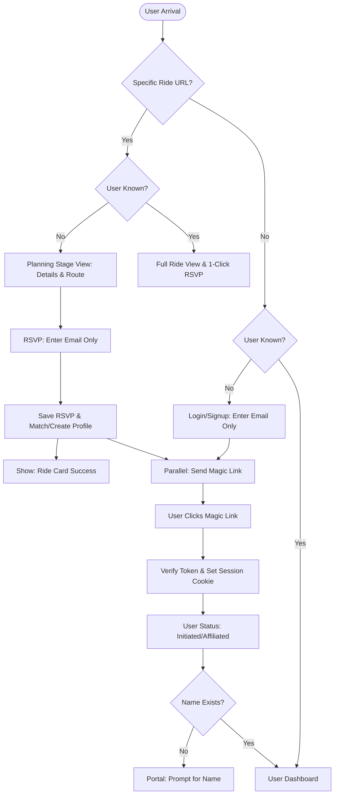

# Frictionless Sign Up v3: Action Plan

This document outlines the implementation of the "Frictionless Sign Up" flow, prioritizing immediate user engagement by allowing RSVPs and access to ride details via email only, deferring full authentication and profile completion to a secondary step.

## 1. Core Logic Overview

*   **The Hook:** Users landing on a specific Ride URL can see details (meetup, route, time) and RSVP immediately using **Email only**.
*   **The Bridge:** Authentication (Magic Link) is triggered by the RSVP but does not block the "Success" state of the RSVP. The user remains "locked" to the ride view until verified.
*   **The Destination:** Verification via Magic Link transitions the user from `Guest` to `Initiated` or `Affiliated`, unlocking the full portal and prompting for profile details (Name).

## 2. Mermaid Diagram (v3)

## 3. Implementation Requirements

### A. Frontend (React/Portal)
*   **Planning Stage View:** Create a "locked" version of the Ride Detail page that hides navigation/sidebar but displays: Date/Time, Meetup Location, Start Location, and Route Map.
*   **Minimalist RSVP Form:** A single input field for `email` with a "Join Ride" button.
*   **Conditional Navigation:** If the user is an unverified `Guest`, the sidebar is replaced with a "Verify email for full access" call-to-action.

### B. Backend (Supabase/Edge Functions)
*   **Upsert Logic:** The RSVP function must check if the email exists.
    *   If yes: Associate RSVP with existing `user_id`.
    *   If no: Create a placeholder user/profile and associate the RSVP.
*   **Magic Link Trigger:** Ensure `signInWithOtp` is triggered automatically upon Guest RSVP.

### C. Database (PostgreSQL)
*   **Participants Table:** Allow `user_id` to link to profiles that may not yet have a `full_name`.
*   **RLS Policies:** Update policies to allow `Guest` status (unverified email) to select specific ride details if they possess the valid `ride_id` (the "Secret URL" trust).

## 4. Success Metrics

*   **Conversion Rate:** Percentage of Guest arrivals that complete an RSVP.
*   **Verification Rate:** Percentage of Guest RSVPs that eventually click the Magic Link.
*   **Profile Completion:** Percentage of `Initiated` users who provide a Name within 24 hours of first login.

## 5. Future Hardening (Post-MVP)

*   **Rate Limiting:** Implement rate limiting on the RSVP email trigger to prevent spam.
*   **Visibility Toggles:** "Club Only" visibility toggle for sensitive ride details (e.g., private start locations).
*   **Bot Protection:** Add a "hidden" CAPTCHA (like Cloudflare Turnstile) to the RSVP form if abuse is detected.
